# CodeHorse Feature Documentation and Deep Interview Answers

This document explains CodeHorse feature by feature, with diagrams and detailed
answers you can use in an interview. It is written to help you explain not only
what the project does, but also why each technical decision exists and how the
end-to-end flows work.

## Table of Contents

1. Project overview
2. Product user journey
3. System architecture diagram
4. Frontend architecture diagram
5. Database model diagram
6. Feature 1: GitHub OAuth authentication
7. Feature 2: Protected dashboard shell
8. Feature 3: Dashboard analytics
9. Feature 4: Repository workspace
10. Feature 5: GitHub webhook integration
11. Feature 6: Manual AI review trigger
12. Feature 7: Inngest background AI review pipeline
13. Feature 8: AI-generated review output
14. Feature 9: Repository indexing and RAG context
15. Feature 10: Review history and review cockpit
16. Feature 11: Diagnostics and health monitoring
17. Feature 12: Settings workspace
18. Feature 13: Subscription UI
19. API and route handler documentation
20. Server action documentation
21. Data flow and state management
22. Security explanation
23. Failure handling explanation
24. Deployment explanation
25. Deep interview answers
26. Demo script
27. Future improvements

## 1. Project Overview

CodeHorse is an AI code review and engineering dashboard for GitHub
repositories. The core idea is simple:

1. A developer signs in with GitHub.
2. The developer connects a repository.
3. CodeHorse creates a pull request webhook for that repository.
4. When a pull request is opened, updated, reopened, marked ready, or merged,
   CodeHorse queues an AI review job.
5. The AI job fetches the pull request diff, optionally retrieves repository
   context from Pinecone, asks Gemini to produce structured review output, posts
   feedback on GitHub, and saves the review in PostgreSQL.
6. The user can view analytics, review history, and diagnostics in the
   dashboard.

### One Line Interview Pitch

CodeHorse is a full-stack GitHub engineering OS that uses Next.js, Better Auth,
Prisma, PostgreSQL, Octokit, Inngest, Gemini, and optional Pinecone RAG to
connect repositories and generate AI-powered pull request reviews.

### Expanded Interview Pitch

CodeHorse is a production-style SaaS project built around a real developer
workflow. It authenticates users with GitHub OAuth, lets them connect GitHub
repositories, installs pull request webhooks, and runs AI code review jobs in
the background. The review pipeline is asynchronous with Inngest, uses GitHub
APIs to fetch PR diffs, uses Gemini to generate structured engineering feedback,
optionally uses Pinecone for repository context, posts review feedback back to
GitHub, and stores all review history in PostgreSQL through Prisma. The frontend
is a dashboard built with Next.js App Router, React Query, Tailwind CSS,
shadcn-style components, and Recharts.

## 2. Product User Journey

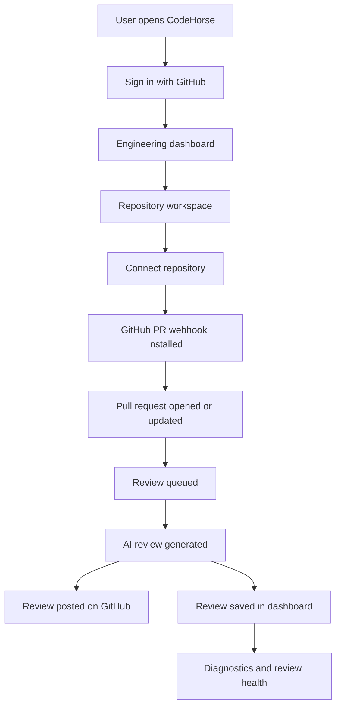

### User-Level Features

| Feature | User Value |
| --- | --- |
| GitHub login | No extra password, fast developer onboarding |
| Protected dashboard | Only authenticated users access workspace |
| Repository browser | User can find and connect GitHub repositories |
| Webhook setup | Reviews can run automatically on PR events |
| Manual review trigger | User can queue reviews on demand |
| Review cockpit | User can inspect generated reviews and failures |
| Dashboard analytics | User sees commits, PRs, reviews, connected repos |
| Diagnostics | User can understand stale data and pipeline health |
| Settings | User manages profile and connected repositories |
| Subscription UI | Shows monetization-ready plan and usage interface |

## 3. System Architecture Diagram

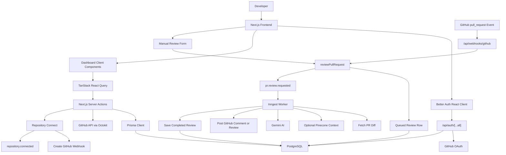

### Architecture Explanation

The frontend is a Next.js App Router application. Authentication and dashboard
data calls are split between client components and server actions. Client
components handle forms, filters, tabs, charts, and interactive UI. Server
actions handle protected operations such as reading the session, using GitHub
tokens, querying Prisma, creating webhooks, and queueing background work.

The AI work is intentionally moved out of request/response routes. Webhooks and
manual actions only queue jobs. Inngest handles the expensive multi-step AI
workflow so the app can give the user quick feedback and keep the review
pipeline observable.

## 4. Frontend Architecture Diagram

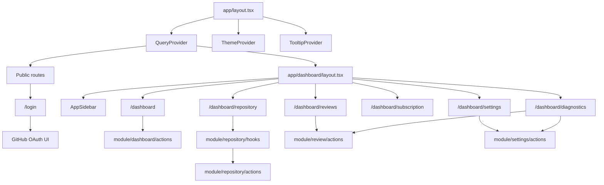

### Frontend Design Explanation

The root layout provides global infrastructure: fonts, theme initialization,
React Query, and tooltip support. The dashboard layout is a protected shell that
checks authentication and renders the sidebar. Dashboard pages are mostly Client
Components because they need React Query, forms, filters, tabs, local state, and
event handlers.

This separation is useful in interviews because it shows you understand the
Next.js App Router model:

- Use Server Components and server layouts for authentication gates and request
  specific data such as cookies.
- Use Client Components only where interactivity is needed.
- Keep secret operations inside server actions and route handlers.
- Use React Query for client-side server state, polling, mutation status, and
  invalidation.

## 5. Database Model Diagram

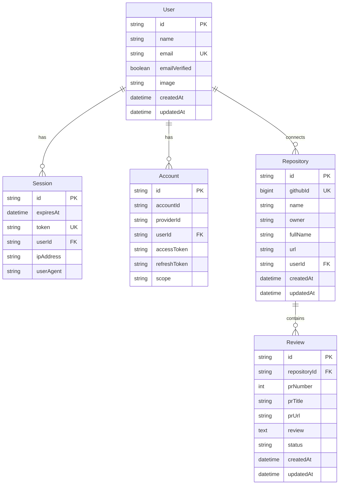

### Database Explanation

Better Auth owns the authentication-related models: `User`, `Session`,
`Account`, and `Verification`. The `Account` model stores the GitHub provider
record and access token. CodeHorse-specific data starts with `Repository` and
`Review`.

`Repository` represents a GitHub repository connected by a user. It stores the
GitHub id, owner, repo name, full name, URL, and user id. `Review` stores AI
review runs for pull requests. A review belongs to a repository, and a
repository belongs to a user. That relationship is used throughout the app to
ensure users only see their own repositories and reviews.

Important design note:

`Repository.githubId` is globally unique in the current schema. That is fine for
this single-owner workflow, but in a team or multi-tenant version I would split
repository identity from user access. For example, I would have a `Repository`
table for GitHub repository metadata and a `RepositoryMembership` or
`ConnectedRepository` table for per-user/per-installation access.

## 6. Feature 1: GitHub OAuth Authentication

### What the Feature Does

Users sign in with GitHub instead of creating a separate CodeHorse password.
After successful OAuth, Better Auth creates or updates user/session/account
records in PostgreSQL. Authenticated users are redirected to the dashboard.

### Main Files

| File | Role |
| --- | --- |
| `lib/auth.ts` | Better Auth configuration |
| `lib/auth-client.ts` | Client-side Better Auth helpers |
| `module/auth/components/login-ui.tsx` | Login UI and GitHub sign-in button |
| `module/auth/components/logout.tsx` | Logout button |
| `module/auth/utils/auth-utils.ts` | Server-side auth guards |
| `app/api/auth/[...all]/route.ts` | Better Auth route handler |
| `app/(auth)/login/page.tsx` | Login page |

### Flow Diagram

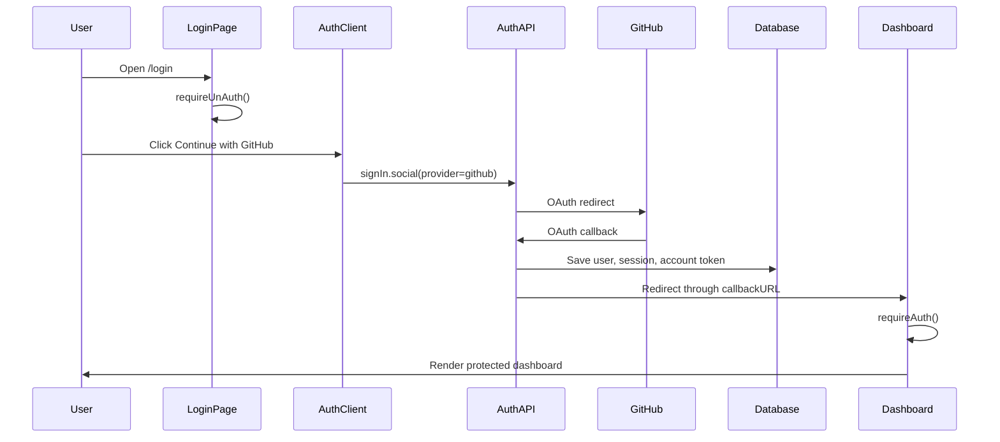

### Implementation Explanation

`lib/auth.ts` configures Better Auth with:

- app name `CodeHorse`
- Prisma adapter
- PostgreSQL provider
- GitHub OAuth provider
- GitHub `repo` scope
- base URL and trusted origin configuration
- production safety checks for required secrets

The login UI calls:

```ts
signIn.social({
  provider: "github",
  callbackURL: "/",
});
```

The root route `/` then calls `requireAuth()` and redirects authenticated users
to `/dashboard`.

### Why It Was Built This Way

OAuth is the best fit because this product is GitHub-centric. The user identity,
repositories, pull requests, tokens, and permissions all come from GitHub. By
using Better Auth, the app avoids hand-rolling session storage, OAuth callback
handling, and account persistence.

### Edge Cases

- Missing `GITHUB_CLIENT_ID` or `GITHUB_CLIENT_SECRET` throws on server startup.
- Missing `BETTER_AUTH_SECRET` in production throws.
- Already authenticated users visiting `/login` are redirected away.
- Unauthenticated users opening `/dashboard` are redirected to `/login`.

### Interview Answer

I used Better Auth with GitHub OAuth because the project is built around GitHub
repositories and pull requests. Authentication is not just login in this app; it
also gives the backend a GitHub account token that server actions can use with
Octokit. I keep token usage server-side only. The frontend can ask for data with
React Query, but the actual token is read in server actions from the Better Auth
`Account` table. Protected routes are enforced by a server-side dashboard layout
using `requireAuth()`, so the user cannot access the workspace without a valid
session.

## 7. Feature 2: Protected Dashboard Shell

### What the Feature Does

The dashboard shell protects all dashboard pages and provides a consistent
navigation/sidebar layout. It includes links to dashboard, repositories,
reviews, subscription, settings, and diagnostics.

### Main Files

| File | Role |
| --- | --- |
| `app/dashboard/layout.tsx` | Server-side protected layout |
| `components/ui/app-sidebar.tsx` | Sidebar navigation and user menu |
| `components/ui/sidebar.tsx` | Sidebar primitives |
| `components/ui/theme-toggle.tsx` | Theme toggle |

### Flow Diagram

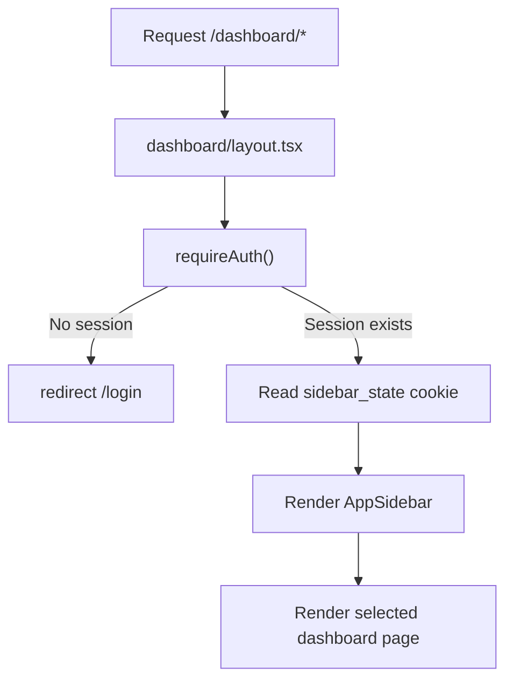

### Implementation Explanation

`app/dashboard/layout.tsx` is a Server Component. It can safely call
`requireAuth()` and read cookies. The layout is marked `dynamic = "force-dynamic"`
because it depends on request-specific session and cookie data.

The sidebar is a Client Component because it uses:

- `usePathname()` to mark active links
- `useSession()` to show user identity
- sidebar collapse interactions
- dropdown menu interactions
- theme toggle
- logout button

### Interview Answer

I placed the authentication boundary at the dashboard layout instead of
repeating it in every dashboard page. That gives one shared guard for all
dashboard routes. The layout remains server-side because auth and cookies are
request-specific, while the sidebar is client-side because it needs current
pathname, dropdowns, session display, theme toggle, and collapse interactions.
This is a clean App Router split between secure server logic and interactive
browser UI.

## 8. Feature 3: Dashboard Analytics

### What the Feature Does

The dashboard shows engineering activity:

- total commits/contributions
- total pull requests
- total AI reviews
- connected repositories
- contribution heatmap
- monthly activity chart

### Main Files

| File | Role |
| --- | --- |
| `app/dashboard/page.tsx` | Dashboard UI |
| `module/dashboard/actions/index.ts` | Server actions for stats |
| `module/github/lib/github.ts` | GitHub contribution helper |

### Data Sources

| Metric | Source |
| --- | --- |
| Connected repositories | PostgreSQL `Repository` count |
| AI reviews | PostgreSQL `Review` count |
| Contributions | GitHub GraphQL contribution calendar |
| Pull requests | GitHub search API |
| Monthly reviews | PostgreSQL reviews grouped by month in code |
| Monthly commits | GitHub contribution calendar grouped by month in code |

### Data Flow Diagram

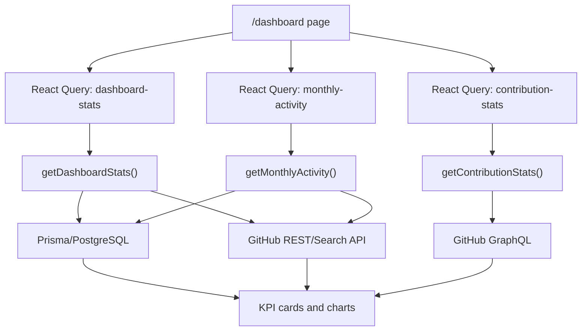

### UI Explanation

The dashboard uses React Query to call server actions with a short stale time.
The UI renders:

- KPI cards with skeleton loading state
- contribution heatmap for daily contribution activity
- composed Recharts chart with bars and lines
- toggle buttons to show or hide commits, PRs, and reviews
- refresh button that refetches all dashboard data

### Interview Answer

The dashboard combines internal product data with GitHub data. Internal data
comes from PostgreSQL, such as connected repositories and AI review counts.
External activity data comes from GitHub APIs, like contribution calendar and PR
counts. I used React Query because this data needs loading states, refetching,
stale time, and refresh controls. The server actions keep the GitHub token and
database access on the server, while the client page only receives safe
aggregated results.

## 9. Feature 4: Repository Workspace

### What the Feature Does

The repository workspace lets the user browse GitHub repositories and connect
repositories to CodeHorse for AI reviews. It supports:

- infinite loading
- search
- language filter
- status filter
- sort
- grid/table view
- connect repository
- disconnect repository
- disconnect all repositories

### Main Files

| File | Role |
| --- | --- |
| `app/dashboard/repository/page.tsx` | Repository UI |
| `module/repository/actions/index.ts` | Server actions |
| `module/repository/hooks/use-repositories.ts` | Infinite query |
| `module/repository/hooks/use-connect-repository.ts` | Connect mutation |
| `module/repository/hooks/use-disconnect-repository.ts` | Disconnect mutations |
| `module/github/lib/github.ts` | GitHub API helpers |

### Repository Connect Flow

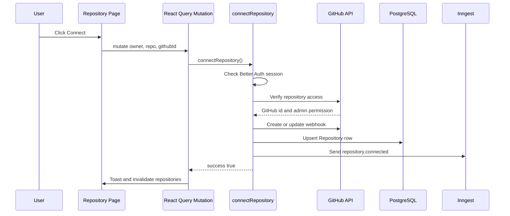

### Repository Disconnect Flow

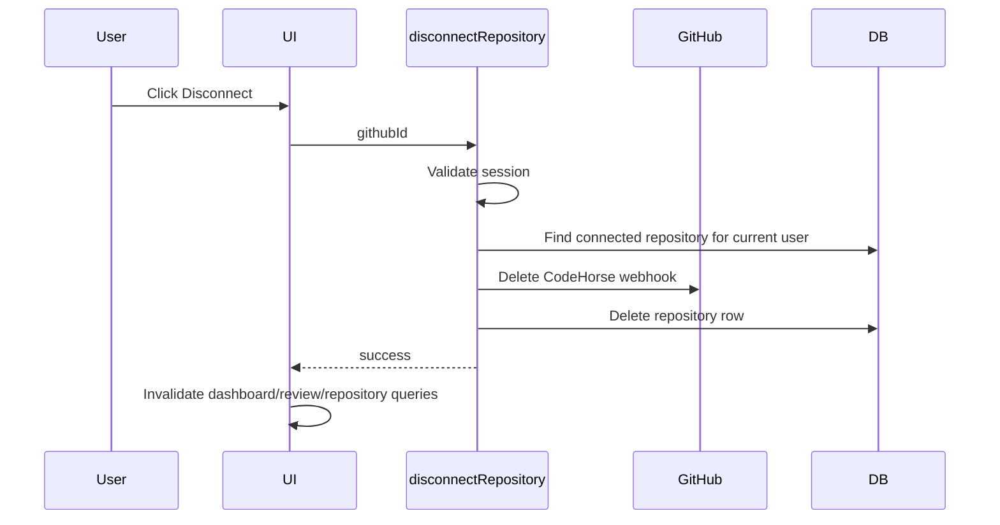

### Implementation Explanation

`fetchRepositories()` loads repositories from GitHub with Octokit and then loads
connected repositories from PostgreSQL. It enriches each GitHub repository with:

- `isConnected`
- `canManageWebhooks`

The UI uses those fields to decide which button to show and whether the user can
connect a repository.

`connectRepository()` does more than just save a row. It verifies the repo,
checks admin permission, creates or updates a GitHub webhook, stores the
repository, and sends a background indexing event.

### Why Admin Permission Is Required

GitHub repository webhooks require permission to manage repository settings.
Without admin access, CodeHorse cannot reliably create the pull request webhook
needed for automatic reviews.

### Interview Answer

The repository page is the bridge between GitHub and CodeHorse. It lists the
authenticated user's repositories with Octokit, then compares them with the
database to mark which ones are already connected. When the user connects a
repository, the backend verifies access and admin permission, creates the
GitHub pull request webhook, stores the repository with Prisma, and sends an
Inngest event for optional indexing. This makes repository connection an actual
integration setup step, not just a UI toggle.

## 10. Feature 5: GitHub Webhook Integration

### What the Feature Does

Connected repositories get a GitHub webhook pointing to:

```text
/api/webhooks/github
```

The webhook listens for pull request events and queues AI reviews automatically.

### Main Files

| File | Role |
| --- | --- |
| `app/api/webhooks/github/route.ts` | Webhook receiver |
| `module/github/lib/github.ts` | Create/delete webhook helpers |
| `module/ai/actions/index.ts` | Review queue action |

### Webhook Processing Diagram

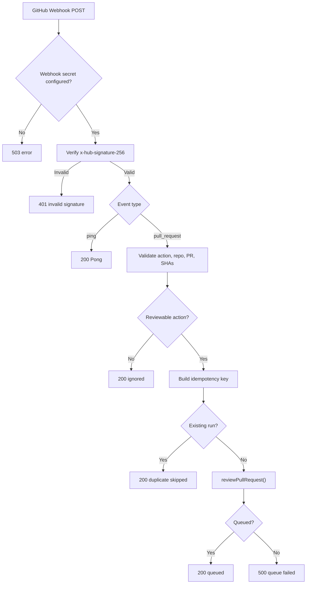

### Reviewable Actions

The webhook queues reviews for:

- `opened`
- `synchronize`
- `reopened`
- `ready_for_review`
- `closed` when the PR was merged

### Security Explanation

GitHub sends a signature in `x-hub-signature-256`. CodeHorse recomputes the
HMAC SHA-256 signature with `GITHUB_WEBHOOK_SECRET` and compares it with
`crypto.timingSafeEqual()`. This prevents attackers from sending fake webhook
payloads.

### Idempotency Explanation

GitHub may retry webhook deliveries. CodeHorse builds an idempotency key from:

```text
deliveryId:fullName:prNumber:action:headSha
```

Before queueing a new review, it checks existing review metadata for this key.
If a matching review exists, the route returns a successful skipped response.

### Interview Answer

The webhook route is designed to be secure and idempotent. It first validates
that the webhook secret is configured, then verifies GitHub's HMAC signature
using a timing-safe comparison. It only responds to specific pull request
actions that should produce a review. To avoid duplicate reviews from GitHub
retries, it stores an idempotency key in the review metadata and checks that key
before queueing a new run. The route itself does not generate the AI review; it
queues the review and lets Inngest handle long-running work.

## 11. Feature 6: Manual AI Review Trigger

### What the Feature Does

The user can manually queue an AI review from the Reviews page. The input
supports:

```text
https://github.com/owner/repo/pull/42
owner/repo#42
```

### Main Files

| File | Role |
| --- | --- |
| `app/dashboard/reviews/page.tsx` | Manual review input and UI |
| `module/review/actions/index.ts` | `requestManualReview()` |
| `module/ai/actions/index.ts` | `reviewPullRequest()` |

### Manual Review Diagram

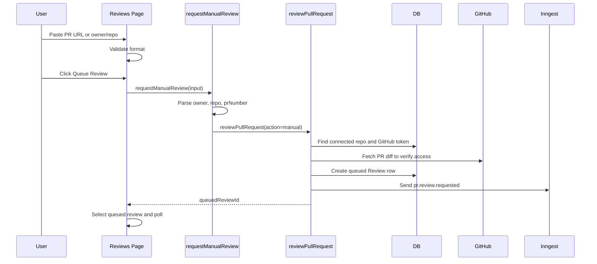

### Implementation Explanation

The client validates the format before calling the server action. The server
still parses and validates the input again because client validation is never a
security boundary. `requestManualReview()` then calls `reviewPullRequest()` with
`action: "manual"`.

`reviewPullRequest()` verifies that the repository is already connected. This
prevents users from reviewing arbitrary repositories through the app unless they
have connected the repo through the proper GitHub permission flow.

### Interview Answer

Manual review is useful for demos, retries, and PRs where a webhook event did
not run. I validate the input on the client for better UX, then parse it again
on the server. The backend only queues reviews for repositories that exist in
the connected repository table, so users cannot use the manual trigger as a
generic GitHub scraping endpoint. It creates a queued review row immediately,
then sends the actual AI review work to Inngest.

## 12. Feature 7: Inngest Background AI Review Pipeline

### What the Feature Does

The AI review pipeline runs in the background. It fetches PR data, retrieves
optional context, asks Gemini for structured output, posts feedback to GitHub,
and stores the completed review.

### Main Files

| File | Role |
| --- | --- |
| `inngest/client.ts` | Inngest client config |
| `app/api/inngest/route.ts` | Inngest serve endpoint |
| `inngest/functions/review.ts` | Main review job |
| `module/ai/actions/index.ts` | Queues review event |
| `module/github/lib/github.ts` | GitHub PR diff and comment helpers |
| `module/ai/lib/rag.ts` | Optional context retrieval |

### Inngest Pipeline Diagram

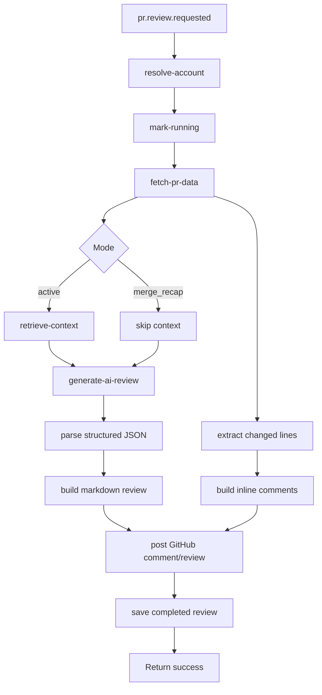

### Inngest Steps

| Step | What It Does |
| --- | --- |
| `resolve-account` | Finds GitHub token and connected repository for the event user |
| `mark-running` | Updates review row to `running` |
| `fetch-pr-data` | Fetches title, description, and diff from GitHub |
| `retrieve-context` | Uses Pinecone for active review context, skips merge recap |
| `generate-ai-review` | Calls Gemini and parses structured JSON |
| `post-comment` | Posts inline review or normal comment to GitHub |
| `save-review` | Saves completed markdown and metadata to DB |

### Why Inngest Is Used

AI review generation can be slow and unreliable because it depends on external
systems:

- GitHub API
- Pinecone
- Gemini
- database persistence
- GitHub comments API

Putting this work in a route handler would make the webhook slow and fragile.
Inngest gives a better boundary for durable background work and step-by-step
observability.

### Interview Answer

I used Inngest because AI review generation is a long-running workflow with
multiple external dependencies. The webhook and manual trigger only create a
queued review and send an event. The Inngest function then runs the expensive
work in clear steps: resolve token, mark running, fetch diff, retrieve context,
generate AI output, post comments, and save the result. This gives the user fast
feedback, makes the pipeline easier to debug, and avoids tying webhook response
time to AI generation time.

## 13. Feature 8: AI-Generated Review Output

### What the Feature Does

Gemini generates a structured review with:

- executive summary
- engineering manager review
- changed files
- Mermaid architecture diagram
- strengths
- findings
- improvements
- risk radar
- test plan
- release readiness
- risk level
- merge recommendation
- optional inline findings

### Main Files

| File | Role |
| --- | --- |
| `inngest/functions/review.ts` | Prompting, parsing, markdown, inline comments |
| `module/github/lib/github.ts` | GitHub comment and PR review helpers |

### Structured Review Shape

The AI is instructed to return JSON with a fixed structure. The app then parses
and validates the result before rendering or posting it.

Important functions:

| Function | Purpose |
| --- | --- |
| `stripJsonFence()` | Removes markdown code fences around model output |
| `toStructuredReview()` | Parses JSON and applies fallback defaults |
| `buildReviewMarkdown()` | Converts structured review into GitHub markdown |
| `extractChangedLines()` | Parses PR diff to identify changed lines |
| `buildInlineComments()` | Filters inline comments to valid changed lines |
| `sanitizeMarkdown()` | Removes null characters |

### Inline Comment Safety Diagram

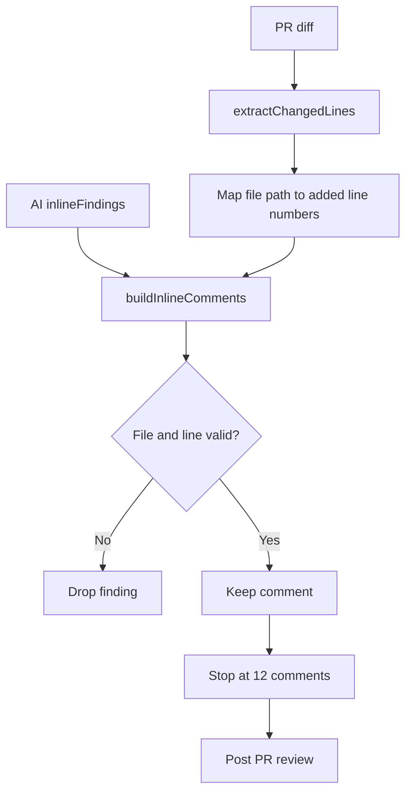

### Why Inline Comments Are Filtered

GitHub inline comments must reference valid lines in the diff. If the AI
suggests a line that is not part of the changed diff, GitHub can reject the
review. The app prevents that by parsing changed lines and only allowing inline
comments on valid added lines.

### Active Review vs Merge Recap

| Mode | Trigger | Output Style |
| --- | --- | --- |
| `active` | opened, synchronized, reopened, ready, manual | Full code review with findings and inline comments |
| `merge_recap` | closed and merged | Concise manager/release recap |

### Interview Answer

The model is not allowed to return arbitrary prose only. I ask Gemini for a
strict JSON object so the app can transform the result into consistent UI and
GitHub markdown. I also validate the parsed fields and provide a safe fallback
if parsing fails. For inline comments, I parse the GitHub diff and only post AI
findings on actual added lines, capped at 12 comments. That makes the AI output
more reliable and prevents invalid GitHub review payloads.

## 14. Feature 9: Repository Indexing and RAG Context

### What the Feature Does

When a repository is connected, CodeHorse can index repository source files into
Pinecone. During an active PR review, it can retrieve relevant context and add
that context to the Gemini prompt.

### Main Files

| File | Role |
| --- | --- |
| `inngest/functions/index.ts` | `indexRepo` function |
| `module/ai/lib/rag.ts` | Embedding, indexing, retrieval |
| `lib/pinecone.ts` | Pinecone config |
| `module/github/lib/github.ts` | Recursive repo file fetch |

### RAG Flow Diagram

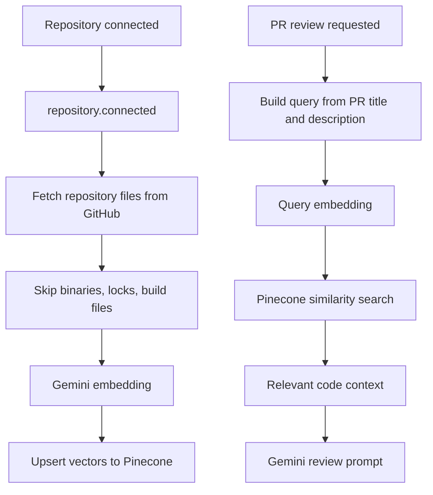

### Implementation Details

`indexCodebase()` skips files such as:

- `node_modules`
- `dist`
- `build`
- `.next`
- `coverage`
- lock files
- minified files
- binary assets
- source maps

It truncates each file content to reduce embedding size and batches vector
upserts into Pinecone.

If Pinecone is not configured, the indexing function returns a skipped result.
That allows the rest of the product to work without vector search.

### Interview Answer

RAG is optional in this project. When Pinecone is configured, connected
repositories are indexed by fetching source files from GitHub, filtering out
build outputs and binary files, embedding file content with Gemini embeddings,
and upserting those vectors to Pinecone. During review, the PR title and
description are embedded as a query, relevant code snippets are retrieved, and
that context is added to the Gemini prompt. If Pinecone is not configured, the
review pipeline still works without repository context.

## 15. Feature 10: Review History and Review Cockpit

### What the Feature Does

The review cockpit shows queued, running, completed, and failed review runs.
Users can inspect review content, timeline metadata, raw stored output, and the
linked GitHub pull request.

### Main Files

| File | Role |
| --- | --- |
| `app/dashboard/reviews/page.tsx` | Review cockpit UI |
| `module/review/actions/index.ts` | Review list, stats, manual trigger |
| `module/ai/actions/index.ts` | Review queueing |

### Review State Diagram

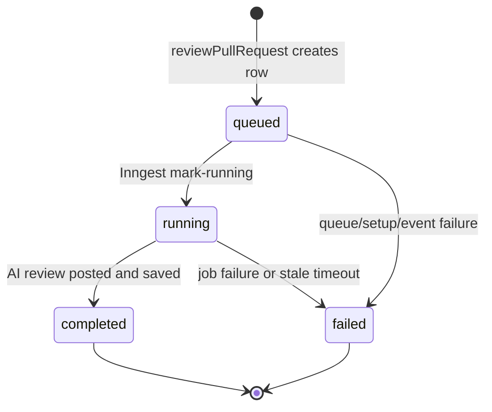

### Review Cockpit UI

The page has:

- stat cards
- manual review panel
- search and filters
- repository filter
- list/compact view mode
- review queue
- selected review panel
- tabs for overview, findings, timeline, and raw output

### Polling Behavior

The review list polls every 3 seconds while any review is active:

- `queued`
- `pending`
- `running`

This makes the UI feel live while the background job is processing.

### Metadata Parsing

The review field stores hidden metadata before the rendered markdown:

```text
<!-- CODEHORSE_RUN -->
status=completed
mode=active
action=manual
commentUrl=https://github.com/...

## CodeHorse PR Review
...
```

The UI removes the metadata for normal display but uses it for timeline and
status details.

### Interview Answer

The review cockpit is built around observable job states. When a review is
queued, the user immediately sees a queued record. When Inngest starts, the
record becomes running. When the review finishes, the UI shows the generated
markdown and GitHub comment link. Active reviews are polled every few seconds
with React Query. I also store metadata in the review body so the UI can show
mode, action, comment URL, and error reason even though the main review output
is markdown.

## 16. Feature 11: Diagnostics and Health Monitoring

### What the Feature Does

Diagnostics helps the user understand whether the review pipeline and GitHub
sync data are healthy or stale.

### Main Files

| File | Role |
| --- | --- |
| `app/dashboard/diagnostics/page.tsx` | Diagnostics UI |
| `module/review/actions/index.ts` | Review health data |
| `module/settings/actions/index.ts` | Connected repository data |

### Diagnostics Flow

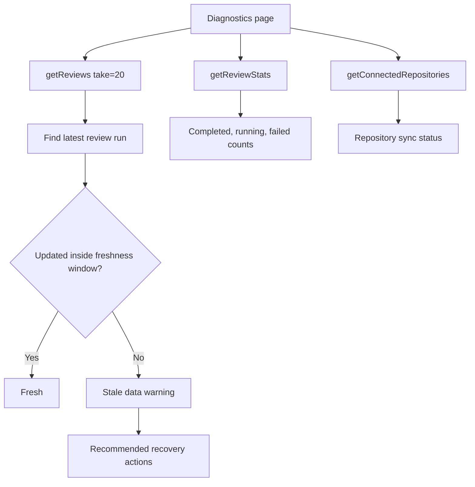

### What Diagnostics Shows

- latest review run
- completed review count
- running review count
- failed review count
- stale data status
- GitHub sync status
- diagnostic logs derived from current state
- recommended recovery actions

### Stale Data Logic

The page uses a 30-minute freshness window. If there is no latest run timestamp,
an old timestamp, or an error loading review/stats data, diagnostics shows a
stale or warning state.

### Interview Answer

Diagnostics is an operational feature. Instead of silently showing old or empty
data, the app surfaces when review run data is missing, stale, or failed. It
combines recent review runs, review stats, connected repository data, and query
freshness to show whether the pipeline looks healthy. In the current version,
logs are derived from client state, but a production version would persist
webhook deliveries, job events, retries, and external API errors.

## 17. Feature 12: Settings Workspace

### What the Feature Does

Settings lets the user manage:

- profile name and email
- connected GitHub account display
- connected repositories
- security and access information
- notification toggles
- integrations
- billing settings link
- theme preferences

### Main Files

| File | Role |
| --- | --- |
| `app/dashboard/settings/page.tsx` | Settings UI |
| `module/settings/actions/index.ts` | Profile and repo server actions |
| `components/ui/theme-toggle.tsx` | Theme control |

### Settings Data Flow

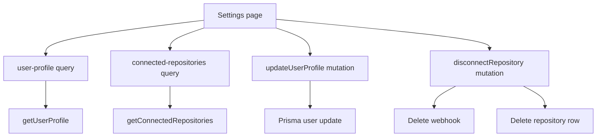

### Interview Answer

The settings page shows how the app handles account and workspace management.
Profile and connected repositories are real server-backed features. Profile
updates go through a server action and Prisma. Repository disconnect deletes the
GitHub webhook and the database row. Some controls, like notification toggles,
token rotation, and GitHub disconnect, are currently UI placeholders that show
the intended product direction.

## 18. Feature 13: Subscription UI

### What the Feature Does

The subscription page shows Free and Pro plans, a current plan card, usage
signals, comparison table, billing readiness, and security note.

### Main File

| File | Role |
| --- | --- |
| `app/dashboard/subscription/page.tsx` | Subscription UI |

### Current Implementation

This is a frontend-only feature. It uses local component state to simulate plan
changes and displays toasts. It is ready for a real billing integration but does
not currently persist subscriptions or connect to Stripe.

### Interview Answer

The subscription screen is intentionally a product-ready UI layer rather than a
complete billing system. It models the plan comparison, current plan state, and
usage surface that a billing integration would need. In production I would add a
provider such as Stripe, persist subscription state in the database, verify
webhook events from Stripe, and enforce usage limits in server actions like
repository connection and manual review queueing.

## 19. API and Route Handler Documentation

### Route Handler Overview

| Route | Methods | Purpose |
| --- | --- | --- |
| `/api/auth/[...all]` | `GET`, `POST` | Better Auth routes |
| `/api/inngest` | `GET`, `POST`, `PUT` | Inngest function endpoint |
| `/api/webhooks/github` | `POST` | GitHub webhook receiver |

### `/api/auth/[...all]`

File: `app/api/auth/[...all]/route.ts`

This route delegates to Better Auth through `toNextJsHandler(auth)`. Better Auth
uses it for OAuth, callbacks, session operations, and auth-related requests.

### `/api/inngest`

File: `app/api/inngest/route.ts`

This route serves the Inngest functions:

- `indexRepo`
- `generateReview`

It uses Node.js runtime and `maxDuration = 300` because review generation can be
long-running.

### `/api/webhooks/github`

File: `app/api/webhooks/github/route.ts`

This route handles GitHub webhooks. It verifies signatures, handles ping events,
validates pull request payloads, checks idempotency, and queues AI reviews.

## 20. Server Action Documentation

### Authentication Actions

| Function | Explanation |
| --- | --- |
| `requireAuth()` | Reads the Better Auth session from request headers. Redirects to `/login` if missing. |
| `requireUnAuth()` | Redirects authenticated users away from `/login`. |

### Repository Actions

| Function | Explanation |
| --- | --- |
| `fetchRepositories()` | Lists GitHub repositories and enriches them with DB connection state. |
| `connectRepository()` | Verifies access, creates webhook, upserts repository, sends indexing event. |
| `disconnectRepository()` | Deletes GitHub webhook and repository row for one repo. |
| `disconnectAllRepositories()` | Deletes webhooks and rows for all connected repos. |

### Review Actions

| Function | Explanation |
| --- | --- |
| `getReviews()` | Lists reviews for the current user's connected repositories. |
| `getReviewStats()` | Counts total, completed, failed, running, and repositories reviewed. |
| `requestManualReview()` | Parses a PR identifier and queues a manual review. |
| `reviewPullRequest()` | Creates queued review and sends Inngest event. |

### AI/RAG Actions

| Function | Explanation |
| --- | --- |
| `generateEmbedding()` | Generates Gemini embeddings for documents or queries. |
| `indexCodebase()` | Embeds source files and upserts vectors into Pinecone. |
| `retrieveContext()` | Finds repository context relevant to a PR. |

### Dashboard Actions

| Function | Explanation |
| --- | --- |
| `getContributionStats()` | Gets GitHub contribution calendar for heatmap. |
| `getDashboardStats()` | Aggregates commits, PRs, reviews, and repository count. |
| `getMonthlyActivity()` | Produces 12-month commits, PRs, and reviews data. |

### Settings Actions

| Function | Explanation |
| --- | --- |
| `getUserProfile()` | Reads current user profile from DB. |
| `updateUserProfile()` | Updates name/email and revalidates pages. |
| `getConnectedRepositories()` | Lists connected repositories for settings/diagnostics. |
| `disconnectRepository()` | Deletes webhook and DB row by repository id. |

## 21. Data Flow and State Management

### React Query State Flow

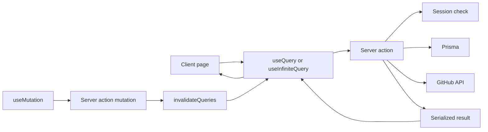

### Why React Query Is Useful Here

React Query handles:

- loading state
- error state
- refetching
- stale time
- polling while reviews are running
- infinite pagination for repositories
- mutation pending state
- query invalidation after connect/disconnect/manual review

### Important Query Keys

| Query Key | Used By |
| --- | --- |
| `repositories` | Repository page |
| `connected-repositories` | Settings and diagnostics |
| `dashboard-stats` | Dashboard |
| `monthly-activity` | Dashboard |
| `contribution-stats` | Dashboard |
| `reviews` | Reviews page |
| `review-stats` | Reviews and diagnostics |
| `review-diagnostics` | Diagnostics |
| `user-profile` | Settings |

### Interview Answer

I used React Query because the dashboard is mostly server state: GitHub
repositories, review runs, stats, connected repositories, and user profile. It
gives a consistent way to handle loading states, polling, pagination, and
invalidation. For example, after disconnecting a repository, the app invalidates
repository, review, dashboard, and diagnostic queries so every screen reflects
the new state.

## 22. Security Explanation

### Security Controls

| Area | Control |
| --- | --- |
| Authentication | GitHub OAuth through Better Auth |
| Session protection | Dashboard layout calls `requireAuth()` |
| Token handling | GitHub token read only in server code |
| Webhook verification | HMAC SHA-256 signature validation |
| Timing attack prevention | `crypto.timingSafeEqual()` |
| Repository authorization | Repository actions filter by current `userId` |
| Webhook permissions | Connect requires GitHub admin access |
| Production URL safety | App URL helpers prevent localhost production config |

### Deep Security Answer

Security is handled at several layers. Authentication uses GitHub OAuth through
Better Auth, so CodeHorse does not manage passwords. Protected routes are
guarded in the server dashboard layout. GitHub access tokens are stored in the
Better Auth account table and only read inside server actions or route handlers.
The frontend never receives the raw token. Repository and review queries are
scoped by the authenticated user's id, so users only see their own connected
repositories and reviews. GitHub webhooks are verified using HMAC SHA-256 and
timing-safe comparison, which prevents fake webhook payloads from queueing
reviews.

## 23. Failure Handling Explanation

### Failure Cases

| Failure | Handling |
| --- | --- |
| No auth session | Redirect or unauthorized error |
| Missing GitHub token | Throw user-facing error |
| No repository access | Return failure from connect/review action |
| No admin permission | Prevent webhook setup |
| Webhook secret missing | Return 503 |
| Invalid webhook signature | Return 401 |
| Duplicate webhook delivery | Return 200 skipped |
| Inngest not configured | Mark review failed with helpful message |
| Review runner unreachable | User-facing message tells local dev to run Inngest |
| Active review stale | Mark queued/running review failed after 15 minutes |
| Invalid AI JSON | Use fallback structured review |
| Invalid inline comments | Drop comments outside changed lines |

### Deep Failure Handling Answer

The project is designed to fail visibly instead of silently. A manual review
creates a queued row before sending the Inngest event. If setup or queueing
fails, the app records a failed review row with a human-readable error. If a
review stays queued or running too long, `markStaleActiveReviewsAsFailed()`
marks it failed so the UI does not show an infinite running state. In the AI job,
model output parsing has a fallback, and inline comments are validated against
the diff before posting. For webhooks, invalid signatures are rejected and
duplicate deliveries are skipped with idempotency.

## 24. Deployment Explanation

### Deployment Diagram

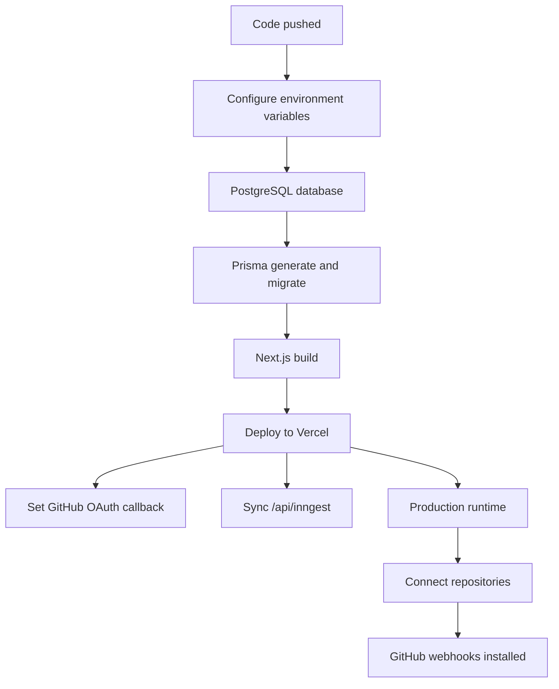

### Required Environment Variables

| Variable | Purpose |
| --- | --- |
| `DATABASE_URL` | PostgreSQL connection |
| `BETTER_AUTH_URL` | Auth base URL |
| `NEXT_PUBLIC_APP_BASE_URL` | Public app URL |
| `BETTER_AUTH_SECRET` | Auth signing secret |
| `BETTER_AUTH_TRUSTED_ORIGINS` | Trusted origins |
| `GITHUB_CLIENT_ID` | GitHub OAuth app id |
| `GITHUB_CLIENT_SECRET` | GitHub OAuth app secret |
| `GITHUB_WEBHOOK_SECRET` | Webhook HMAC secret |
| `GOOGLE_GENERATIVE_AI_API_KEY` | Gemini access |
| `INNGEST_EVENT_KEY` | Inngest production events |
| `INNGEST_SIGNING_KEY` | Inngest signing |
| `PINECONE_API_KEY` | Optional vector DB |
| `PINECONE_INDEX_NAME` | Pinecone index name |

### Local Development

Run the app:

```bash
npm run dev
```

Run Inngest in another terminal:

```bash
npm run inngest
```

Generate Prisma client:

```bash
npm run db:generate
```

Production check:

```bash
npm run vercel:check
```

## 25. Deep Interview Answers

### Question 1: Explain CodeHorse end to end.

Short answer:

CodeHorse lets a GitHub user connect repositories and generate AI pull request
reviews automatically or manually.

Deep answer:

The app starts with GitHub OAuth using Better Auth. After login, the user enters
a protected Next.js dashboard. In the repository workspace, the app lists the
user's GitHub repositories through Octokit and checks which ones are already
connected in PostgreSQL. When the user connects a repository, the backend
verifies admin permission, creates a GitHub pull request webhook, saves the
repository, and optionally sends an indexing job to Inngest. When GitHub sends a
pull request webhook, the route verifies the HMAC signature, checks idempotency,
and queues a review. The review job runs in Inngest, fetches the PR diff,
retrieves optional repository context from Pinecone, asks Gemini for structured
review output, posts feedback back to GitHub, and saves the review in the
database. The dashboard shows analytics, review history, diagnostics, and
settings.

### Question 2: Why did you use Next.js App Router?

Short answer:

It gives file-based routing, layouts, server components, route handlers, and
server actions in one full-stack framework.

Deep answer:

Next.js App Router fits this project because the app needs both frontend pages
and backend endpoints. The `app/` folder maps cleanly to the product routes:
login, dashboard, repository, reviews, settings, diagnostics, and API routes.
The dashboard layout handles authentication once for all child routes. Server
actions are useful for protected operations such as database queries and GitHub
API calls. Route handlers are useful for external integrations like Better Auth,
Inngest, and GitHub webhooks. This keeps the app full-stack without creating a
separate API server.

### Question 3: How is GitHub integration implemented?

Short answer:

The app uses GitHub OAuth for identity and Octokit for repository, webhook, pull
request, diff, and comment APIs.

Deep answer:

After OAuth, Better Auth stores the GitHub account token in the database. Server
actions read that token and create an Octokit client. The repository page uses
Octokit to list authenticated user repositories. When a user connects a repo,
the app verifies that the GitHub id matches and that the user has admin
permission. It then creates or updates a webhook for pull request events. The
review pipeline uses Octokit to fetch PR title, description, diff, changed
files, and to post comments or pull request reviews.

### Question 4: Why did you use Inngest instead of doing AI review in the API route?

Short answer:

AI review generation is slow and multi-step, so it belongs in a background job.

Deep answer:

The review flow depends on several external systems: GitHub, Pinecone, Gemini,
PostgreSQL, and GitHub comments. Running all of that inside a webhook route
would make the webhook slow and fragile. GitHub expects quick webhook responses.
Inngest lets the app respond quickly after queueing a job, while the expensive
work runs asynchronously. It also gives a step-based structure, which makes the
workflow easier to retry, debug, and observe.

### Question 5: How do you prevent duplicate webhook reviews?

Short answer:

The webhook route builds an idempotency key and skips a review if that key
already exists.

Deep answer:

GitHub can retry webhook deliveries, so the same event can arrive multiple
times. CodeHorse builds an idempotency key from the delivery id, repository full
name, PR number, action, and head SHA. This key is stored in the review metadata.
Before queueing a new review, the webhook route searches existing review records
for that key. If it exists, the route returns a successful skipped response.
That prevents duplicate reviews while still allowing new commits or new PR
actions to trigger new reviews.

### Question 6: How does the AI output stay structured and reliable?

Short answer:

The prompt asks Gemini for strict JSON, then the app validates and converts that
JSON into markdown.

Deep answer:

Instead of asking the model for free-form markdown, the app asks for a specific
JSON shape containing summary, manager review, changed files, risk radar,
findings, test plan, release readiness, risk level, recommendation, and inline
findings. The code parses the JSON and validates important fields. If parsing
fails, it returns a safe fallback review that tells the user manual verification
is needed. After parsing, the app builds consistent Markdown for GitHub and the
review cockpit. This makes the output easier to render, inspect, and post.

### Question 7: How are inline comments handled safely?

Short answer:

The app only posts inline comments on lines that exist in the pull request diff.

Deep answer:

GitHub inline comments must target valid changed lines. The app parses the diff
and builds a map of file paths to added line numbers. When Gemini returns
inline findings, the app checks every finding against that map. If the file path
or line number is not valid, the finding is dropped. It also caps inline
comments at 12 so a PR is not overwhelmed. If there are no valid inline
comments, the app posts a normal PR comment instead.

### Question 8: How does repository indexing work?

Short answer:

When configured, CodeHorse embeds source files and stores vectors in Pinecone
for retrieval during reviews.

Deep answer:

After a repository is connected, an Inngest event can trigger `indexRepo`. The
job fetches repository files through GitHub, filters out build outputs, binaries,
lock files, and large irrelevant assets, then creates Gemini embeddings for
source content. Those vectors are upserted to Pinecone with metadata such as
repo id, path, and truncated content. During PR review, the title and
description become a query embedding, Pinecone returns relevant code context,
and that context is added to the Gemini prompt. The feature is optional, so the
review pipeline still works if Pinecone is not configured.

### Question 9: How do you handle stale or stuck reviews?

Short answer:

Queued or running reviews older than 15 minutes are marked failed.

Deep answer:

The app should not show a review as running forever. Before returning review
lists or stats, `markStaleActiveReviewsAsFailed()` finds queued or running
reviews older than 15 minutes for the current user and updates them to failed
with a clear error message. This keeps the review cockpit honest and gives the
user a visible retry path.

### Question 10: What would you improve next?

Short answer:

I would add structured review metadata columns, persisted diagnostics logs, real
billing, tests, and stronger repository indexing limits.

Deep answer:

The current project is feature-rich, but several production hardening steps are
clear. I would split review metadata out of the text field into columns such as
mode, action, idempotency key, comment URL, and error reason. I would persist
webhook deliveries and Inngest job logs for better diagnostics. I would connect
the subscription UI to Stripe and enforce usage limits in server actions. I
would add tests for webhook signature verification, duplicate delivery handling,
repository connection, manual review parsing, and review state transitions. I
would also add file count, file size, and rate limit controls to repository
indexing for large repositories.

## 26. Demo Script

Use this as your interview walkthrough:

1. Start on `/login`.
2. Explain Better Auth and GitHub OAuth.
3. Sign in and show the protected dashboard.
4. Open the sidebar and explain dashboard route structure.
5. Show dashboard metrics and explain GitHub plus database data sources.
6. Go to `/dashboard/repository`.
7. Search/filter repositories and connect a repo.
8. Explain admin permission and webhook creation.
9. Go to `/dashboard/reviews`.
10. Queue a manual review with `owner/repo#number`.
11. Explain queued, running, completed, and failed states.
12. Open a completed review and show overview, findings, timeline, raw tabs.
13. Explain Gemini structured JSON and GitHub comment posting.
14. Go to `/dashboard/diagnostics`.
15. Explain stale data detection and health checks.
16. Go to settings and show profile/repository management.
17. Go to subscription and explain future billing integration.

## 27. Future Improvements

### Production Hardening

- Persist webhook deliveries.
- Persist Inngest job logs.
- Add retry policies and dead-letter handling.
- Add rate limiting for manual review queue.
- Add GitHub API rate limit awareness.
- Add file count and file size limits for repository indexing.

### Data Model Improvements

- Split review metadata into columns.
- Add repository installation or membership model.
- Add subscription and usage tables.
- Add notification preferences table.
- Add diagnostics log table.

### Product Improvements

- Real Stripe billing.
- Team workspaces.
- GitHub App installation flow instead of OAuth-only repo scope.
- Review severity filters.
- Review approval/blocking rules.
- Custom review prompts by repository.
- Email or Slack notifications.

### Testing Improvements

- Unit tests for PR identifier parsing.
- Unit tests for webhook signature verification.
- Unit tests for diff changed-line extraction.
- Integration tests for repository connect/disconnect.
- Integration tests for review queue failure paths.
- E2E tests for login, repository connection, and manual review flow.

