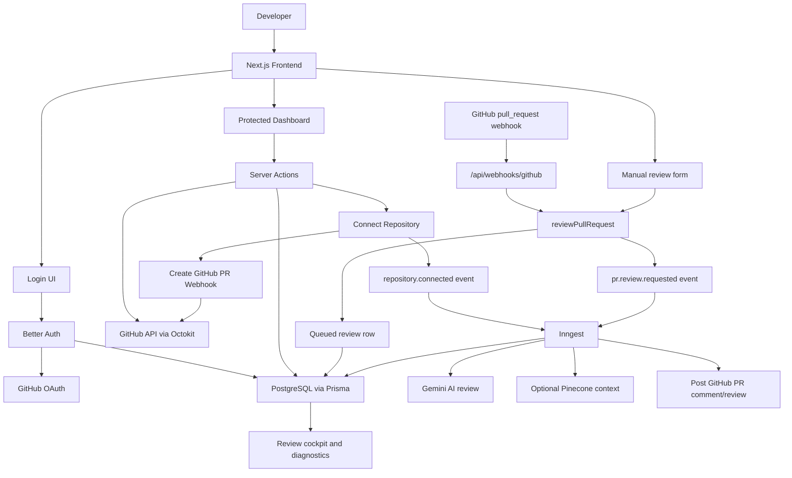
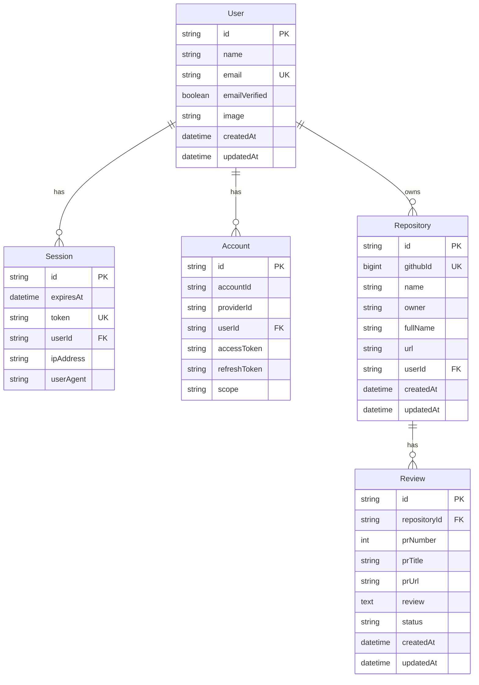
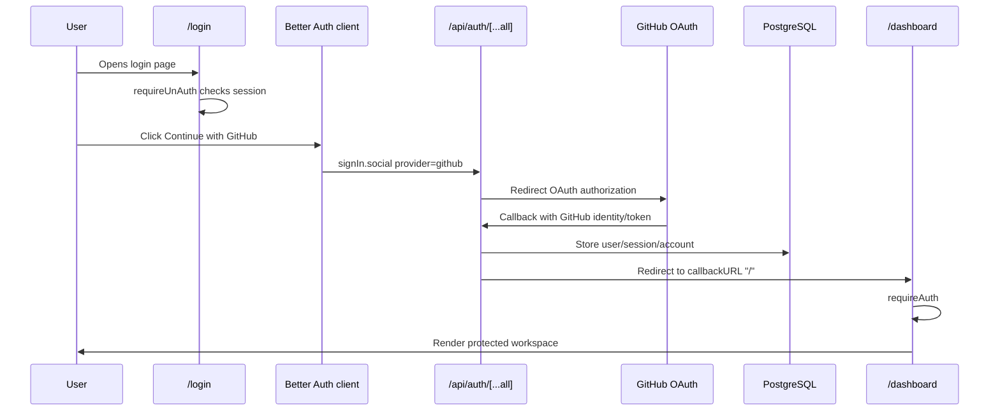
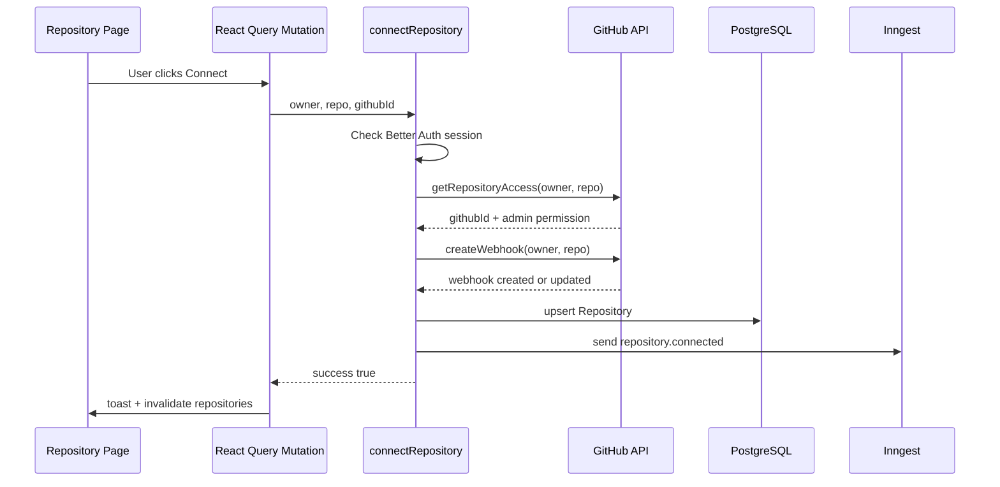
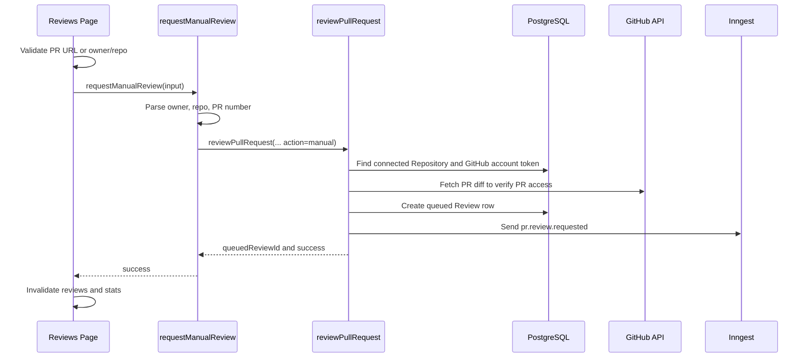
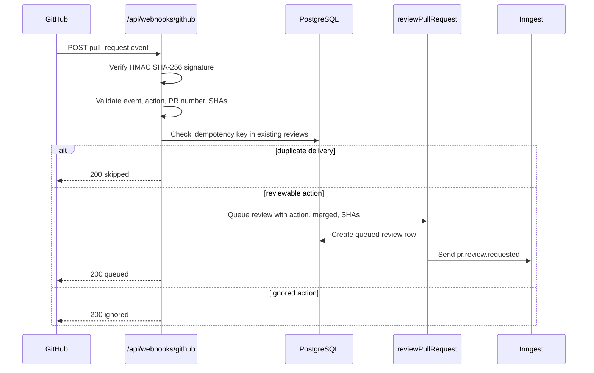
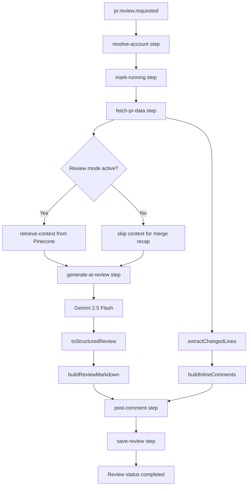
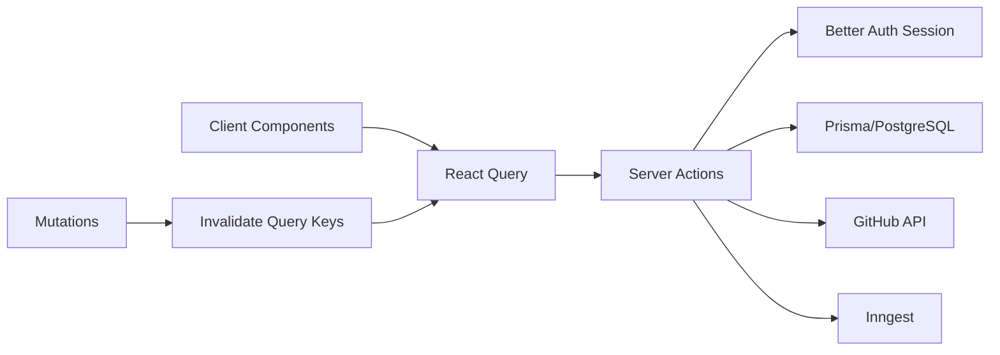
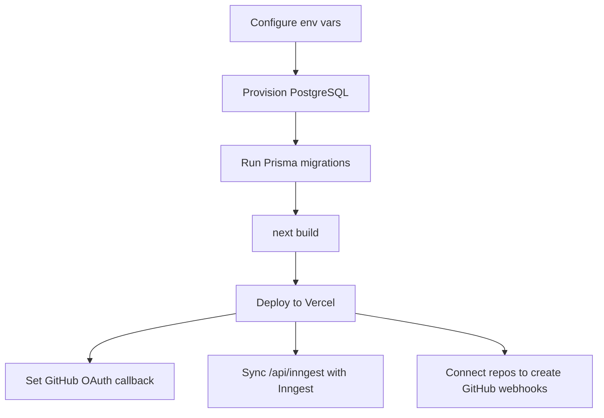

# CodeHorse Interview Study Material

This document is a complete study guide for explaining CodeHorse in an
interview. It covers the product idea, tech stack, architecture, frontend routes,
server actions, APIs, background jobs, database models, AI review flow, and
common interview answers.

## 1. One Minute Project Pitch

CodeHorse is a full-stack AI code review SaaS for GitHub repositories. A user
signs in with GitHub, connects repositories where they have admin access,
CodeHorse installs pull request webhooks, and every supported pull request event
can trigger an AI review workflow. The app stores repository and review history
in PostgreSQL, runs long-running review work with Inngest, uses Gemini through
the AI SDK to generate structured engineering feedback, and shows everything in
a dashboard with repository management, review history, diagnostics, settings,
and subscription screens.

Good interview summary:

> I built CodeHorse as an Engineering OS for GitHub teams. The app uses Next.js
> App Router, TypeScript, Better Auth with GitHub OAuth, Prisma/PostgreSQL,
> Octokit, Inngest background jobs, Google Gemini, optional Pinecone RAG, and a
> React Query powered dashboard. The main workflow is GitHub OAuth -> connect
> repository -> create webhook -> queue AI review from webhook or manual trigger
> -> generate and post PR feedback -> store review history -> surface health and
> diagnostics in the UI.

## 2. Study Order

1. Understand the product and users.
2. Understand the route map and dashboard pages.
3. Understand authentication and GitHub OAuth.
4. Understand repository connection and webhook setup.
5. Understand the AI PR review pipeline.
6. Understand database models and relationships.
7. Understand React Query state flow on the frontend.
8. Prepare interview answers around security, async jobs, failure handling, and
   tradeoffs.

## 3. Tech Stack

| Layer | Technology | Project Use |
| --- | --- | --- |
| Framework | Next.js 16 App Router | Pages, layouts, route handlers, server actions |
| UI Runtime | React 19 | Client components and dashboard interactivity |
| Language | TypeScript | Strict typed application code |
| Styling | Tailwind CSS 4, shadcn-style UI, Radix/Base UI | Design tokens, components, dashboard UI |
| Icons | lucide-react | Sidebar, buttons, metrics, UI signals |
| Auth | Better Auth | GitHub OAuth, sessions, accounts |
| Database | PostgreSQL | Users, sessions, OAuth accounts, repositories, reviews |
| ORM | Prisma 7 with `@prisma/adapter-pg` | Typed database client generated into `lib/generated/prisma` |
| GitHub | Octokit REST and GraphQL | Repositories, webhooks, PR diffs, comments, contribution calendar |
| Async Jobs | Inngest | Repository indexing and AI review generation |
| AI | Vercel AI SDK + `@ai-sdk/google` | Gemini embeddings and Gemini text generation |
| Vector DB | Pinecone | Optional repository context retrieval for review prompts |
| Client Data | TanStack React Query | Dashboard fetching, polling, mutations, invalidation |
| Charts | Recharts | Monthly activity chart |
| Notifications | Sonner | Success/error/info toasts |
| Deployment | Vercel-ready | Production env vars and route handlers |

## 4. Next.js 16 Mental Model Used Here

The repo includes a warning that this is not an old Next.js version. The local
Next docs in `node_modules/next/dist/docs/` confirm these important ideas:

- `app/` uses file-system based App Router routes.
- `page.tsx` defines route UI.
- `layout.tsx` wraps child routes and preserves shared UI.
- Pages and layouts are Server Components by default.
- Client Components need `"use client"` when they use state, event handlers,
  effects, browser APIs, or React Query.
- Route Handlers are `route.ts` files in `app/api/**`.
- Route Handlers use Web `Request`/`Response`, plus Next extensions like
  `NextRequest` and `NextResponse`.

How the repo applies that:

- `app/layout.tsx` is the root layout and provider shell.
- `app/dashboard/layout.tsx` protects all dashboard routes with `requireAuth`.
- Most dashboard pages are Client Components because they use React Query,
  local state, filters, forms, and event handlers.
- API endpoints live in `app/api/auth/[...all]/route.ts`,
  `app/api/inngest/route.ts`, and `app/api/webhooks/github/route.ts`.

## 5. Project Folder Map

```text
app/
  layout.tsx                         Root providers, fonts, theme script
  page.tsx                           Authenticated root redirect to /dashboard
  (auth)/login/page.tsx              Public login page
  dashboard/layout.tsx               Protected dashboard shell
  dashboard/page.tsx                 Engineering command center
  dashboard/repository/page.tsx      GitHub repository browser/connector
  dashboard/reviews/page.tsx         AI review cockpit
  dashboard/review/page.tsx          Alias to /dashboard/reviews
  dashboard/subscription/page.tsx    Frontend billing/subscription UI
  dashboard/settings/page.tsx        Profile, repos, security, integrations
  dashboard/diagnostics/page.tsx     Health/staleness diagnostics
  api/auth/[...all]/route.ts         Better Auth handler
  api/inngest/route.ts               Inngest serve endpoint
  api/webhooks/github/route.ts       GitHub webhook receiver

components/ui/
  app-sidebar.tsx                    Dashboard navigation and user menu
  providers/query-provider.tsx       React Query provider
  providers/theme-providers.tsx      Custom light/dark/system theme provider
  theme-toggle.tsx                   Light/dark/system segmented toggle
  many shadcn-style primitives       Button, badge, tabs, dialogs, etc.

module/
  auth/                              Login UI, logout button, auth guards
  dashboard/actions/                 Dashboard server actions
  github/lib/github.ts               GitHub token, API, webhook, PR helpers
  repository/actions/                Repository connect/disconnect actions
  repository/hooks/                  React Query hooks for repositories
  review/actions/                    Review list/stats/manual queue actions
  ai/actions/                        Queue review requests
  ai/lib/rag.ts                      Embeddings, Pinecone indexing/query
  settings/actions/                  Profile and connected repo actions

inngest/
  client.ts                          Inngest client/config
  functions/index.ts                 Repository indexing function
  functions/review.ts                AI review generation function

lib/
  auth.ts                            Better Auth config
  auth-client.ts                     Client auth helpers
  db.ts                              Prisma singleton
  app-url.ts                         App URL, trusted origins, webhook URL
  pinecone.ts                        Pinecone config helpers
  utils.ts                           `cn` className utility

prisma/
  schema.prisma                      Database schema
  migrations/                        Migration history
```

## 6. High Level System Architecture



## 7. Database Architecture



Important model notes:

- Better Auth owns `User`, `Session`, `Account`, and `Verification` records.
- GitHub access tokens are stored in the `Account` model.
- `Repository.githubId` is unique. This means a GitHub repository can exist
  once in CodeHorse storage.
- `Repository.userId` links a connected repo to the authenticated user.
- `Review.repositoryId` links each review run to a connected repository.
- Repository delete cascades review delete through Prisma relations.
- The `review.review` text field stores both metadata and markdown output.

## 8. Authentication Flow

Files:

- `lib/auth.ts`
- `lib/auth-client.ts`
- `module/auth/utils/auth-utils.ts`
- `module/auth/components/login-ui.tsx`
- `module/auth/components/logout.tsx`
- `app/api/auth/[...all]/route.ts`
- `app/(auth)/login/page.tsx`



Key implementation points:

- `lib/auth.ts` configures Better Auth with app name `CodeHorse`.
- GitHub OAuth requires `GITHUB_CLIENT_ID` and `GITHUB_CLIENT_SECRET`.
- Production requires `BETTER_AUTH_SECRET`.
- GitHub scope is `repo`, because the app needs repository and webhook access.
- `getAuthBaseURLConfig()` and `getAuthTrustedOrigins()` avoid localhost being
  used accidentally in production.
- `requireAuth()` redirects unauthenticated users to `/login`.
- `requireUnAuth()` redirects already-authenticated users away from `/login`.
- `Logout` calls Better Auth `signOut`, then routes to `/login`.

## 9. Frontend Route Study Guide

### Root Layout

File: `app/layout.tsx`

Responsibilities:

- Loads Geist Sans and Geist Mono through `next/font/google`.
- Imports global CSS and activity calendar tooltip CSS.
- Adds a `beforeInteractive` theme initialization script to prevent theme flash.
- Wraps the app with React Query, theme provider, and tooltip provider.

### `/`

File: `app/page.tsx`

- Server route.
- Calls `requireAuth()`.
- Redirects authenticated users to `/dashboard`.

### `/login`

File: `app/(auth)/login/page.tsx`

- Server page that calls `requireUnAuth()`.
- Renders `LoginUI`.

Main frontend behavior in `LoginUI`:

- Client Component.
- Tracks `isLoading`.
- Calls `signIn.social({ provider: "github", callbackURL: "/" })`.
- Shows a marketing/auth experience around GitHub OAuth, trust signals,
  security points, and a preview dashboard card.
- Includes theme toggle.

### `/dashboard/layout`

File: `app/dashboard/layout.tsx`

- Server layout.
- `dynamic = "force-dynamic"` because it reads cookies and session state.
- Calls `requireAuth()` before rendering dashboard pages.
- Reads `sidebar_state` cookie to preserve sidebar open/collapsed state.
- Renders `AppSidebar` plus `SidebarInset`.

### Dashboard Sidebar

File: `components/ui/app-sidebar.tsx`

Features:

- Client Component.
- Reads current path with `usePathname()`.
- Reads user session with `useSession()`.
- Navigation items:
  - Dashboard
  - Repository
  - Reviews
  - Subscription
  - Settings
  - Diagnostics
- Has collapsible sidebar button.
- Has user menu with theme toggle and logout.

### `/dashboard`

File: `app/dashboard/page.tsx`

Purpose:

- Engineering Command Center.
- Shows GitHub activity and review metrics.

React Query calls:

- `["dashboard-stats"]` -> `getDashboardStats()`
- `["monthly-activity"]` -> `getMonthlyActivity()`
- `["contribution-stats"]` -> `getContributionStats()`

UI pieces:

- KPI cards for commits, PRs, AI reviews, repositories.
- Contribution heatmap for the last year.
- Recharts composed chart for commits, PRs, and reviews.
- Series toggles for chart visibility.
- Refresh button refetches all dashboard queries.
- Empty review panel links to `/dashboard/reviews`.

### `/dashboard/repository`

File: `app/dashboard/repository/page.tsx`

Purpose:

- GitHub repository workspace.
- Browse, search, filter, sort, connect, disconnect, and bulk disconnect
  repositories.

React Query and mutation hooks:

- `useRepositories()` -> infinite query over GitHub repositories.
- `useConnectRepository()` -> connect selected repo.
- `useDisconnectRepository()` -> disconnect one repo.
- `useDisconnectAllRepositories()` -> disconnect all connected repos.

Frontend features:

- Search by repo name, full name, description, language.
- Filter by language.
- Filter by status: all, connected, not connected, admin required.
- Sort by recently updated, name, or language.
- Grid/table view toggle.
- Load more repositories.
- Connection buttons disabled when user lacks admin/webhook permission.
- Side panels for onboarding, workspace insights, and operational status.

Server flow behind connect:

1. Validate session.
2. Verify GitHub repository access.
3. Require admin permissions to manage webhooks.
4. Create or update GitHub pull request webhook.
5. Upsert repository in PostgreSQL.
6. Send `repository.connected` Inngest event for indexing.
7. Invalidate/refetch repository query.

### `/dashboard/reviews`

File: `app/dashboard/reviews/page.tsx`

Purpose:

- AI Review Cockpit.
- Queue manual reviews, inspect history, and open GitHub PRs.

React Query calls:

- `["reviews", search, status]` -> `getReviews({ search, status })`
- `["review-stats"]` -> `getReviewStats()`

Polling:

- Review list polls every 3 seconds while any review is `queued`, `pending`,
  or `running`.
- Review stats poll every 3 seconds while `running > 0`.

Manual review behavior:

- Input accepts either:
  - `https://github.com/owner/repo/pull/42`
  - `owner/repo#42`
- Validates input on client.
- Calls `requestManualReview()`.
- On success, clears filters, selects the queued review, invalidates review
  queries, and shows toast feedback.

Review detail UI:

- Left panel: queue of review runs.
- Right panel: selected review.
- Tabs:
  - Overview: rendered markdown output.
  - Findings: link to GitHub comments if available.
  - Timeline: status, mode, action, timestamps, errors.
  - Raw: raw stored review field.

Important frontend helper functions:

- `getVisibleReviewBody()` removes hidden run metadata before display.
- `parseReviewMarkdown()` parses a controlled subset of markdown into UI blocks.
- `renderInlineMarkdown()` handles bold inline text.
- `getManualReviewValidation()` validates manual PR input.

### `/dashboard/review`

File: `app/dashboard/review/page.tsx`

- Re-exports the `/dashboard/reviews` page.
- Treat this as a compatibility alias.

### `/dashboard/subscription`

File: `app/dashboard/subscription/page.tsx`

Purpose:

- Subscription and billing UI.

Current behavior:

- Frontend-only state for `free` and `pro` plan selection.
- Simulates plan change with a short delay and toast.
- `Manage Billing` shows a toast placeholder.
- Includes current plan card, usage panel, pricing cards, comparison table,
  billing readiness, and security note.

Interview note:

- This screen is UI-ready, but not integrated with a real billing provider yet.
  A production version would connect Stripe or another billing API, persist
  subscriptions, and enforce limits in server actions.

### `/dashboard/settings`

File: `app/dashboard/settings/page.tsx`

Purpose:

- Account, repository, security, notification, integration, and billing settings.

React Query calls:

- `["user-profile"]` -> `getUserProfile()`
- `["connected-repositories"]` -> `getConnectedRepositories()`

Mutations:

- `updateUserProfile()`
- `disconnectRepository(repositoryId)`

Tabs:

- Profile: display name/email form and GitHub-linked identity.
- Repositories: connected repository list, view, configure placeholder,
  disconnect with confirmation.
- Security: OAuth/security explanation and permission controls.
- Notifications: local toggle state for notification preferences.
- Integrations: GitHub, review engine, billing rows.
- Billing: link to subscription page.

### `/dashboard/diagnostics`

File: `app/dashboard/diagnostics/page.tsx`

Purpose:

- Operational health dashboard for review pipeline and GitHub sync.

React Query calls:

- `["review-diagnostics"]` -> `getReviews({ take: 20 })`
- `["review-stats"]` -> `getReviewStats()`
- `["connected-repositories"]` -> `getConnectedRepositories()`

Key logic:

- `STALE_WINDOW_MS = 30 minutes`.
- Uses latest review updated timestamp plus query update time to decide whether
  data is fresh or stale.
- Derives completed/running/failed stats from server stats or loaded runs.
- Provides copy/download diagnostic log helpers.
- Health actions refetch review, stats, repository, and dashboard queries.

Interview note:

- Diagnostics are not persisted logs yet. The page derives health from current
  queries and generated state. A production improvement would store job events,
  webhook deliveries, external API failures, and retry data.

### Placeholder Routes

- `/about` -> simple placeholder.
- `/settings` -> simple placeholder separate from `/dashboard/settings`.
- `/prachi` -> simple placeholder.

## 10. API and Route Handler Surface

### Better Auth API

File: `app/api/auth/[...all]/route.ts`

```ts
export const runtime = "nodejs";
export const { GET, POST } = toNextJsHandler(auth);
```

Purpose:

- Handles Better Auth routes for login, callback, session, and logout related
  operations.
- Uses Node.js runtime because auth/database operations require Node APIs.

### Inngest API

File: `app/api/inngest/route.ts`

```ts
export const runtime = "nodejs";
export const maxDuration = 300;
export const { GET, POST, PUT } = serve({
  client: inngest,
  functions: [indexRepo, generateReview],
});
```

Purpose:

- Exposes Inngest functions to local Inngest dev server or Inngest Cloud.
- Serves repository indexing and AI review functions.
- Allows long duration for AI review work.

### GitHub Webhook API

File: `app/api/webhooks/github/route.ts`

Method:

- `POST`

Runtime:

- Node.js.

Max duration:

- 60 seconds.

Headers used:

- `x-hub-signature-256`
- `x-github-event`
- `x-github-delivery`

Supported events:

- `ping` -> responds with `Pong`.
- `pull_request` -> may queue AI review.

Reviewable pull request actions:

- `opened`
- `synchronize`
- `reopened`
- `ready_for_review`
- `closed` only when the PR was merged, for merge recap mode.

Security:

- Uses HMAC SHA-256 with `GITHUB_WEBHOOK_SECRET`.
- Uses `crypto.timingSafeEqual()` to prevent timing attacks.

Duplicate delivery protection:

- Builds idempotency key:

```text
deliveryId:fullName:prNumber:action:headSha
```

- Checks existing `Review.review` metadata for that idempotency key.
- Skips duplicate deliveries.

Responses:

- `503` if webhook secret is missing.
- `401` if signature is invalid.
- `400` if pull request payload is invalid.
- `200` for ignored actions, ping, duplicate skips, or successful queue.
- `500` if queueing the review fails.

## 11. Server Actions and Function Use Cases

### `module/auth/utils/auth-utils.ts`

| Function | Use Case |
| --- | --- |
| `requireAuth()` | Server guard for protected routes. Redirects to `/login` without a session. |
| `requireUnAuth()` | Server guard for login page. Redirects authenticated users away from `/login`. |

### `lib/app-url.ts`

| Function | Use Case |
| --- | --- |
| `normalizeAppOrigin()` | Converts env URL/host to a safe origin and rejects invalid values. |
| `isLocalAppOrigin()` | Detects localhost origins so production does not accidentally use them. |
| `getAppBaseUrl()` | Returns configured app origin with production safety checks. |
| `getPublicAppBaseUrl()` | Chooses a public app URL for external callbacks/webhooks. |
| `getAuthAllowedHosts()` | Builds Better Auth allowed hosts from env and Vercel hosts. |
| `getAuthBaseURLConfig()` | Provides Better Auth base URL config with fallback and allowed hosts. |
| `getAuthTrustedOrigins()` | Builds trusted origin list from localhost, Vercel, request headers, and env. |
| `getGitHubWebhookUrl()` | Returns `${publicBaseUrl}/api/webhooks/github`. |

### `module/github/lib/github.ts`

| Function | Use Case |
| --- | --- |
| `getGithubToken()` | Reads current session, finds GitHub account token in DB, throws if unavailable. |
| `fetchUserContribution(token, username)` | GitHub GraphQL contribution calendar for heatmap and totals. |
| `getRepositories(page, perPage)` | Lists authenticated user's GitHub repos sorted by recent update. |
| `getRepositoryAccess(owner, repo)` | Confirms repo exists and checks admin permission for webhooks. |
| `createWebhook(owner, repo)` | Creates or updates a pull request webhook for CodeHorse. |
| `deleteWebhook(owner, repo)` | Finds CodeHorse webhook by URL and deletes it. |
| `getRepoFileContents(token, owner, repo, path)` | Recursively fetches non-binary repository file contents for indexing. |
| `getPullRequestDiff(token, owner, repo, prNumber)` | Fetches PR title, description, and diff. |
| `postReviewComment(token, owner, repo, prNumber, review)` | Posts a standard issue comment on a PR. |
| `getPullRequestFiles(token, owner, repo, prNumber)` | Lists changed PR files. Currently available helper, not central to current flow. |
| `postPullRequestReview(token, owner, repo, prNumber, body, comments)` | Posts inline PR review comments when available, otherwise falls back to a normal comment. |

### `module/repository/actions/index.ts`

| Function | Use Case |
| --- | --- |
| `fetchRepositories(page, perPage)` | Returns GitHub repos enriched with `isConnected` and `canManageWebhooks`. |
| `connectRepository(owner, repo, githubId)` | Verifies access, creates webhook, upserts repository, sends indexing event. |
| `disconnectRepository(githubId)` | Deletes GitHub webhook, removes repository row, revalidates dashboard pages. |
| `disconnectAllRepositories()` | Deletes webhooks for all connected repos and removes all user's repository rows. |

### `module/repository/hooks`

| Hook | Use Case |
| --- | --- |
| `useRepositories()` | Infinite React Query for repository list pagination. |
| `useConnectRepository()` | Mutation wrapper around `connectRepository`, success/error toasts, query invalidation. |
| `useDisconnectRepository()` | Mutation wrapper around one repo disconnect with optimistic query cache update. |
| `useDisconnectAllRepositories()` | Mutation wrapper around bulk disconnect with query invalidation. |

### `module/dashboard/actions/index.ts`

| Function | Use Case |
| --- | --- |
| `getContributionStats()` | Gets GitHub contribution calendar and maps days into heatmap levels. |
| `getDashboardStats()` | Counts connected repos and reviews from DB, commits/PRs from GitHub. |
| `getMonthlyActivity()` | Builds last 12 months of commits, PRs, and review counts for charting. |

### `module/review/actions/index.ts`

| Function | Use Case |
| --- | --- |
| `getReviews(params)` | Lists review history for current user with search/status/repository filters. |
| `getReviewStats()` | Counts total/completed/failed/running/repositories reviewed. |
| `requestManualReview(prIdentifier)` | Parses PR URL or `owner/repo#number`, then queues review. |
| `parseRunMeta(reviewBody)` | Extracts mode, action, comment URL, and error metadata from stored review text. |
| `markStaleActiveReviewsAsFailed(userId)` | Marks queued/running reviews older than 15 minutes as failed. |
| `parsePrIdentifier(value)` | Supports manual review input formats. |

### `module/ai/actions/index.ts`

| Function | Use Case |
| --- | --- |
| `reviewPullRequest(owner, repo, prNumber, options)` | Validates repo/token, verifies PR diff, creates queued review, sends Inngest event, records failures. |
| `getReviewErrorMessage(error, stage)` | Converts setup/GitHub/Inngest failures into user-facing messages. |

Important design point:

- This action does not generate the review itself.
- It performs quick validation, creates a queued DB snapshot, then delegates the
  expensive work to Inngest.

### `module/ai/lib/rag.ts`

| Function | Use Case |
| --- | --- |
| `generateEmbedding(text, taskType)` | Creates Gemini embedding with 768 dimensions. |
| `indexCodebase(repoId, files)` | Filters source files, embeds content, upserts vectors to Pinecone. |
| `retrieveContext(query, repoId, topK)` | Embeds query and retrieves related repository context from Pinecone. |

### `inngest/client.ts`

| Export | Use Case |
| --- | --- |
| `isInngestConfigured()` | Allows local dev via `INNGEST_DEV=1` or production via event key. |
| `inngest` | Inngest client with id `codehorse`. |

### `inngest/functions/index.ts`

| Function | Trigger | Use Case |
| --- | --- | --- |
| `indexRepo` | `repository.connected` | Fetches source files and indexes them in Pinecone when configured. |

### `inngest/functions/review.ts`

| Function | Use Case |
| --- | --- |
| `generateReview` | Main Inngest function for `pr.review.requested`. |
| `extractChangedLines(diff)` | Parses diff and records valid added lines for inline comments. |
| `toStructuredReview(raw)` | Parses Gemini JSON into a safe structured review object with fallback. |
| `buildReviewMarkdown(review, mode)` | Converts structured review to Markdown for GitHub/UI. |
| `buildInlineComments(review, changedLines)` | Keeps inline comments only on changed lines, max 12 comments. |
| `upsertRunSnapshot(...)` | Updates queued review or latest matching review with running/completed status. |

### `module/settings/actions/index.ts`

| Function | Use Case |
| --- | --- |
| `getUserProfile()` | Fetches current user's id, name, email, image, and created date. |
| `updateUserProfile(data)` | Updates current user's name/email and revalidates settings/review pages. |
| `getConnectedRepositories()` | Lists current user's connected repositories. |
| `disconnectRepository(repositoryId)` | Deletes webhook and DB row by repository database id. |
| `disconnectAllRepositories()` | Deletes all current user's webhooks and repository rows. |

## 12. End-to-End Flow: Connect Repository



Failure cases to explain:

- No session -> unauthorized.
- GitHub cannot verify access -> user sees failure.
- User lacks admin permissions -> cannot create webhook.
- GitHub webhook create fails -> user-facing message.
- Inngest indexing event failure is logged but repository connection can still
  succeed, because indexing is optional/fire-and-forget.

## 13. End-to-End Flow: Manual PR Review



## 14. End-to-End Flow: GitHub Webhook PR Review



Review modes:

- `active`: opened, synchronize, reopened, ready for review, manual.
- `merge_recap`: closed and merged.

## 15. End-to-End Flow: Inngest AI Review Generation



Important AI design points:

- Gemini is asked to return strict JSON.
- The code strips JSON fences if the model wraps the result.
- The parser validates every major field and falls back safely when parsing
  fails.
- Inline comments are only posted on added lines from the PR diff.
- Inline comments are capped at 12 to avoid overwhelming the PR.
- If there are no inline comments, CodeHorse posts a normal PR comment.
- Merge recap mode produces a shorter release/manager-oriented review.

## 16. Review Data Lifecycle

Statuses:

- `queued`: `reviewPullRequest()` created DB row and sent Inngest event.
- `running`: Inngest picked up the event and started processing.
- `completed`: AI review was generated, posted to GitHub, and saved.
- `failed`: setup, GitHub, Inngest, stale, or DB persistence failure path.

Metadata stored inside `Review.review`:

```text
<!-- CODEHORSE_RUN -->
status=completed
mode=active
action=manual
headSha=...
baseSha=...
deliveryId=...
idempotency=...
commentUrl=...

## CodeHorse PR Review
...
```

Why this matters:

- The UI can parse metadata for status, mode, action, comment URL, and errors.
- The visible review body strips metadata for a cleaner UI.
- The webhook route uses `idempotency=...` to detect duplicate deliveries.

## 17. React Query Data Flow



Important query keys:

| Query Key | Owner Screen | Server Action |
| --- | --- | --- |
| `["repositories"]` | Repository page | `fetchRepositories()` |
| `["connected-repositories"]` | Settings, diagnostics | `getConnectedRepositories()` |
| `["dashboard-stats"]` | Dashboard | `getDashboardStats()` |
| `["monthly-activity"]` | Dashboard | `getMonthlyActivity()` |
| `["contribution-stats"]` | Dashboard | `getContributionStats()` |
| `["reviews", search, status]` | Reviews page | `getReviews()` |
| `["review-stats"]` | Reviews, diagnostics | `getReviewStats()` |
| `["review-diagnostics"]` | Diagnostics | `getReviews({ take: 20 })` |
| `["user-profile"]` | Settings | `getUserProfile()` |

Mutation invalidation examples:

- Connect repository invalidates `["repositories"]`.
- Disconnect repository invalidates repositories, connected repos, dashboard
  stats, reviews, review stats, and diagnostics.
- Manual review invalidates reviews and review stats.
- Settings profile update invalidates user profile.

## 18. Security and Reliability Talking Points

Authentication:

- GitHub OAuth through Better Auth.
- No app password flow.
- Sessions stored in DB.
- Protected dashboard layout calls `requireAuth()`.

GitHub access:

- GitHub access token is read server-side from the Better Auth `Account`.
- Token is never exposed directly to the frontend.
- Repository connection requires admin permission because webhooks need admin
  access.

Webhook security:

- Requires `GITHUB_WEBHOOK_SECRET`.
- Verifies `x-hub-signature-256`.
- Uses `timingSafeEqual`.
- Rejects invalid signatures.

Idempotency:

- Webhook delivery id, repository, PR number, action, and head SHA form the
  idempotency key.
- Duplicate deliveries are skipped.

Long-running work:

- AI review generation runs in Inngest, not the webhook request itself.
- Webhook queues work quickly.
- Inngest has step boundaries for account lookup, running status, PR fetch,
  context retrieval, generation, posting, and saving.

Failure handling:

- Review setup failures create or update failed review rows.
- Active queued/running reviews older than 15 minutes are marked failed.
- User-facing errors explain missing Inngest configuration, unreachable runner,
  GitHub network failure, or missing repository/token.

## 19. Local Development

Install dependencies:

```bash
npm install
```

Generate Prisma client:

```bash
npm run db:generate
```

Start Next.js:

```bash
npm run dev
```

Start Inngest dev server in another terminal:

```bash
npm run inngest
```

Production verification script:

```bash
npm run vercel:check
```

That runs:

```bash
npm run lint
npm exec tsc -- --noEmit
npm run build
```

Required environment variables from `.env.example`:

```env
DATABASE_URL=
BETTER_AUTH_URL=
NEXT_PUBLIC_APP_BASE_URL=
BETTER_AUTH_SECRET=
BETTER_AUTH_TRUSTED_ORIGINS=
GITHUB_CLIENT_ID=
GITHUB_CLIENT_SECRET=
GITHUB_WEBHOOK_SECRET=
GOOGLE_GENERATIVE_AI_API_KEY=
INNGEST_EVENT_KEY=
INNGEST_SIGNING_KEY=
PINECONE_API_KEY=
PINECONE_DB_API_KEY=
PINECONE_INDEX_NAME=
```

Local OAuth callback:

```text
http://localhost:3000/api/auth/callback/github
```

Production OAuth callback:

```text
https://your-codehorse-domain.vercel.app/api/auth/callback/github
```

GitHub webhook endpoint:

```text
https://your-codehorse-domain.vercel.app/api/webhooks/github
```

Inngest endpoint:

```text
https://your-codehorse-domain.vercel.app/api/inngest
```

## 20. Deployment Flow



Deployment must include:

- PostgreSQL `DATABASE_URL`.
- GitHub OAuth app credentials.
- Better Auth production URL and secret.
- GitHub webhook secret.
- Google AI API key.
- Inngest event and signing keys.
- Optional Pinecone key/index for RAG.

## 21. Important Implementation Tradeoffs

### Why server actions?

Server actions keep sensitive operations server-side while letting frontend
components call typed functions directly. GitHub tokens, DB reads, webhook
creation, and review queueing never need to be exposed in browser code.

### Why Inngest?

PR review generation can take longer than a normal request and has multiple
external dependencies. Inngest gives durable steps, retries, a local dev server,
and clear background job boundaries.

### Why store queued/running/completed snapshots?

It makes the UI responsive and observable. Users see a queued row immediately,
then the row changes to running/completed/failed as the background job advances.

### Why optional Pinecone?

RAG improves review context by retrieving relevant source files, but the app can
still queue and generate reviews without Pinecone. The indexing job skips cleanly
when Pinecone is not configured.

### Why use GitHub webhooks and manual review?

Webhooks automate normal PR workflows. Manual review is useful for demos,
backfills, retries, and PRs where webhook delivery did not happen.

## 22. Known Gaps and Future Improvements

Use these honestly in interviews as next-step discussion:

- Subscription UI is not connected to a real billing provider yet.
- Notification preferences are local UI state, not persisted.
- Diagnostics logs are derived in the client, not persisted server-side.
- Some settings actions such as token rotation and GitHub disconnect are
  placeholders.
- Usage limits are TODOs in repository connection flow.
- Repository indexing is fire-and-forget and optional.
- `Repository.githubId` is globally unique, so the current model is best for a
  single connected owner per GitHub repository. A team/multi-tenant version
  should model repository installation/access separately from per-user
  membership.
- `getRepoFileContents()` recursively fetches files and may need rate limit,
  size limit, and path depth controls for very large repositories.
- PR search uses GitHub search API for aggregate PR counts, which may hit
  GitHub rate limits at scale.
- `Review.review` stores metadata as text. A future schema could split status
  metadata into first-class columns for easier querying.

## 23. Interview Q&A Prep

### What problem does CodeHorse solve?

It helps developers and teams connect GitHub repositories, monitor engineering
activity, and generate AI-powered pull request reviews with actionable feedback
directly on GitHub and inside a dashboard.

### What is the most important end-to-end flow?

GitHub OAuth -> repository connection -> webhook creation -> pull request event
or manual trigger -> queued review row -> Inngest background job -> fetch PR diff
-> optional RAG context -> Gemini structured review -> GitHub comment/inline
review -> completed review history in the dashboard.

### How is authentication handled?

Better Auth handles GitHub OAuth. The app stores sessions and OAuth accounts in
PostgreSQL through Prisma. Protected dashboard routes call `requireAuth()` on
the server. Client components use `useSession()` for user display, not for
security-sensitive backend access.

### How do you ensure users can only manage their own repositories?

Server actions read the current Better Auth session and query repositories by
`userId`. Repository disconnect actions check both repository id/GitHub id and
the current user. Review listing filters through `repository.userId`.

### Why does repository connection require GitHub admin access?

The app installs a GitHub webhook on the repository. GitHub requires sufficient
repository permissions for webhook management, so the app checks
`data.permissions?.admin`.

### What happens when a GitHub webhook arrives?

The route verifies the HMAC signature, validates the pull request payload,
checks whether the action should trigger a review, builds an idempotency key,
skips duplicates, and calls `reviewPullRequest()` to queue the Inngest job.

### How do you prevent duplicate reviews from duplicate webhook deliveries?

The webhook route stores an idempotency key in the review metadata. Before
queueing a new review, it searches for an existing review containing that key.
If found, it returns a successful skipped response.

### How does the AI review get generated?

Inngest receives `pr.review.requested`, resolves the GitHub token and repository,
marks the run as running, fetches PR diff/title/description, retrieves optional
Pinecone context, prompts Gemini for strict JSON, parses it into a structured
review, formats markdown, posts comments to GitHub, and saves the completed run.

### How do inline comments stay valid?

The code parses the diff and records added line numbers for each changed file.
Generated inline findings are filtered so they only target changed lines. Invalid
file paths or non-changed lines are dropped.

### What happens if Gemini returns invalid JSON?

`toStructuredReview()` catches parsing errors and returns a safe fallback
review. This avoids crashing the job and tells the user manual verification is
needed.

### What is the purpose of Pinecone?

When a repository is connected, CodeHorse can index source files into Pinecone
using Gemini embeddings. During review, it retrieves relevant repository context
for the PR title/description and includes that context in the AI prompt.

### What does the dashboard show?

It shows connected repository count, generated review count, GitHub contribution
activity, PR count, monthly activity, contribution heatmap, and links into review
workflows.

### What does diagnostics show?

It shows latest review run freshness, completed/running/failed counts, GitHub
sync signals, stale data warnings, and recommended recovery actions such as
refreshing diagnostics, resyncing GitHub, triggering a manual review, or checking
repository access.

### What would you improve next?

I would split review metadata into structured DB columns, add persisted job/webhook
logs, add real billing with persisted subscriptions and usage limits, improve
repository indexing limits for large repos, and add automated tests for webhook
signature/idempotency and review queueing.

## 24. Demo Script

Use this order when showing the project:

1. Open `/login` and explain GitHub OAuth.
2. Sign in and land on `/dashboard`.
3. Show the sidebar, theme toggle, and protected layout.
4. Open `/dashboard/repository`.
5. Search/filter repositories and connect one with admin access.
6. Explain that connection creates a GitHub PR webhook and queues indexing.
7. Open `/dashboard/reviews`.
8. Trigger a manual review with `owner/repo#number`.
9. Explain queued/running/completed statuses and polling.
10. Show review detail tabs: overview, findings, timeline, raw.
11. Open GitHub PR comment from the review.
12. Open `/dashboard/diagnostics` and explain pipeline health.
13. Open `/dashboard/settings` and show profile/repository management.
14. Open `/dashboard/subscription` and say billing UI is ready but payment
    integration is future work.

## 25. Short Resume Bullets

- Built a full-stack AI code review SaaS with Next.js 16 App Router, React 19,
  TypeScript, Prisma, PostgreSQL, Better Auth, GitHub OAuth, Inngest, Gemini,
  Pinecone, React Query, and Tailwind CSS.
- Implemented secure GitHub OAuth and protected dashboard routes with server-side
  session enforcement.
- Integrated GitHub REST and GraphQL APIs for repository browsing, webhooks, PR
  diffs, comments, pull request stats, and contribution analytics.
- Designed an async AI review pipeline using Inngest, queued/running/completed
  review states, duplicate webhook protection, structured Gemini output, and
  inline comment validation against PR diff lines.
- Built a responsive developer dashboard with repository management, review
  cockpit, contribution charts, diagnostics, settings, theme switching, and
  subscription UI.

## 26. File Reference Cheat Sheet

| Area | Main Files |
| --- | --- |
| Auth config | `lib/auth.ts`, `lib/auth-client.ts`, `module/auth/utils/auth-utils.ts` |
| Login UI | `app/(auth)/login/page.tsx`, `module/auth/components/login-ui.tsx` |
| Dashboard shell | `app/dashboard/layout.tsx`, `components/ui/app-sidebar.tsx` |
| Dashboard metrics | `app/dashboard/page.tsx`, `module/dashboard/actions/index.ts` |
| Repository flow | `app/dashboard/repository/page.tsx`, `module/repository/actions/index.ts`, `module/repository/hooks/*` |
| GitHub helpers | `module/github/lib/github.ts` |
| Review UI | `app/dashboard/reviews/page.tsx` |
| Review actions | `module/review/actions/index.ts`, `module/ai/actions/index.ts` |
| AI job | `inngest/functions/review.ts` |
| Repository indexing | `inngest/functions/index.ts`, `module/ai/lib/rag.ts` |
| API handlers | `app/api/auth/[...all]/route.ts`, `app/api/inngest/route.ts`, `app/api/webhooks/github/route.ts` |
| Settings | `app/dashboard/settings/page.tsx`, `module/settings/actions/index.ts` |
| Diagnostics | `app/dashboard/diagnostics/page.tsx` |
| Database | `prisma/schema.prisma`, `lib/db.ts` |
| Theme/design | `app/globals.css`, `components/ui/providers/theme-providers.tsx`, `components/ui/theme-toggle.tsx` |
