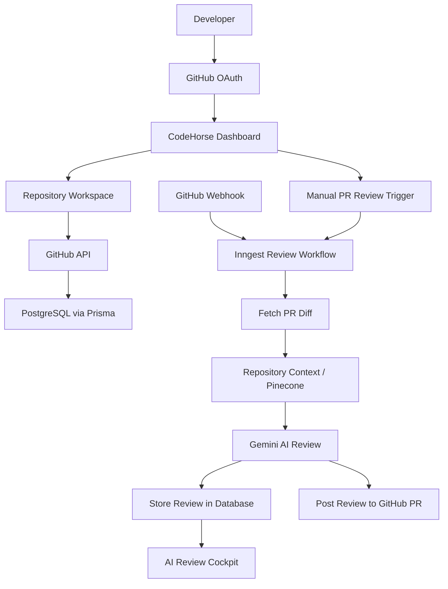

# CodeHorse

<div align="center">

**AI Code Reviewer**

Connect GitHub, track repository activity, and generate AI-powered pull request
reviews with actionable engineering feedback.

[Live Demo](https://code-horse.vercel.app/login)
·
[GitHub Repository](https://github.com/Prachi2519/CodeHorse)


</div>

## Overview

CodeHorse is a full-stack developer SaaS product that works as an AI Code Reviewer for GitHub. It helps developers and teams connect repository and generate AI-powered pull request reviews.

The product is built around a real production workflow: a user signs in with
GitHub, connects repositories, queues pull request reviews, and receives
structured AI feedback inside a premium developer dashboard.

## Live App

Production URL:

```text
https://code-horse-glzzdf4et-prachi2519s-projects.vercel.app/login
```

## Features

- Secure GitHub OAuth authentication
- Protected dashboard routes
- GitHub repository browsing and connection
- Repository disconnect and disconnect-all actions
- GitHub commit and pull request analytics
- Contribution activity heatmap
- Monthly activity charts
- Manual pull request review trigger
- AI-generated PR reviews with engineering-level feedback
- Review history and diagnostics
- GitHub webhook integration
- Inngest background job workflow
- Light, dark, and system theme support
- Responsive premium SaaS dashboard UI
- Vercel production deployment support

## Product Screens

- Landing and GitHub authentication
- Engineering Command Center dashboard
- Repository workspace
- AI Review Cockpit
- Subscription page
- Settings workspace
- Diagnostics cockpit

## Tech Stack

| Layer | Technology |
| --- | --- |
| Framework | Next.js 16, React |
| Language | TypeScript |
| Styling | Tailwind CSS, shadcn-style components |
| Auth | Better Auth, GitHub OAuth |
| Database | PostgreSQL, Prisma ORM |
| GitHub | GitHub REST API, GitHub Webhooks |
| AI | Google Gemini AI |
| Background Jobs | Inngest |
| Vector Search | Pinecone |
| Charts | Recharts |
| Deployment | Vercel |

## Architecture



## AI Review Flow

1. User connects a GitHub repository.
2. User opens or updates a pull request, or manually queues a PR review.
3. CodeHorse sends a review event to Inngest.
4. Inngest fetches PR metadata and diff from GitHub.
5. CodeHorse retrieves repository context when available.
6. Gemini AI generates a structured engineering review.
7. The review is saved in PostgreSQL and shown in the dashboard.
8. CodeHorse can post feedback back to the GitHub pull request.

## Local Development

Install dependencies:

```bash
npm install
```

Generate Prisma client:

```bash
npm run db:generate
```

Start the Next.js app:

```bash
npm run dev
```

Start Inngest locally in a second terminal:

```bash
npm run inngest
```

Open the app:

```text
http://localhost:3000
```

## Environment Variables

Create a `.env` file using `.env.example` as reference.

Required variables:

```env
DATABASE_URL=
BETTER_AUTH_URL=
NEXT_PUBLIC_APP_BASE_URL=
BETTER_AUTH_SECRET=
BETTER_AUTH_TRUSTED_ORIGINS=

GITHUB_CLIENT_ID=
GITHUB_CLIENT_SECRET=
GITHUB_WEBHOOK_SECRET=

GOOGLE_GENERATIVE_AI_API_KEY=

INNGEST_EVENT_KEY=
INNGEST_SIGNING_KEY=
```

Optional but recommended:

```env
PINECONE_API_KEY=
PINECONE_DB_API_KEY=
PINECONE_INDEX_NAME=
```

## GitHub OAuth Setup

For production, configure your GitHub OAuth app:

```text
Homepage URL:
https://code-horse-glzzdf4et-prachi2519s-projects.vercel.app

Authorization callback URL:
https://code-horse-glzzdf4et-prachi2519s-projects.vercel.app/api/auth/callback/github
```

For local development, use a separate OAuth app or update the callback URL:

```text
http://localhost:3000/api/auth/callback/github
```

## Inngest Setup

Production AI review jobs run through Inngest Cloud.

Set these variables in Vercel:

```env
INNGEST_EVENT_KEY=
INNGEST_SIGNING_KEY=
```

Then sync this deployed endpoint in Inngest:

```text
https://code-horse-glzzdf4et-prachi2519s-projects.vercel.app/api/inngest
```

## Deployment

Run the production check before deploying:

```bash
npm run vercel:check
```

Deploy on Vercel with:

- PostgreSQL `DATABASE_URL`
- GitHub OAuth credentials
- Better Auth production URL and secret
- Gemini API key
- Inngest event and signing keys
- Optional Pinecone keys for repository context retrieval

## Resume Highlights

- Built a production-ready full-stack SaaS platform using Next.js, TypeScript,
  Prisma, PostgreSQL, Better Auth, GitHub APIs, Inngest, Gemini AI, and Vercel.
- Implemented secure GitHub OAuth authentication and protected dashboard routes.
- Integrated GitHub REST APIs and webhooks for repository, PR, and analytics
  workflows.
- Designed an AI-powered pull request review pipeline with background jobs,
  database persistence, and review history.
- Built a premium responsive developer dashboard with charts, diagnostics,
  repository management, and theme support.

## Author

Built by [Prachi Gupta](https://github.com/Prachi2519).

